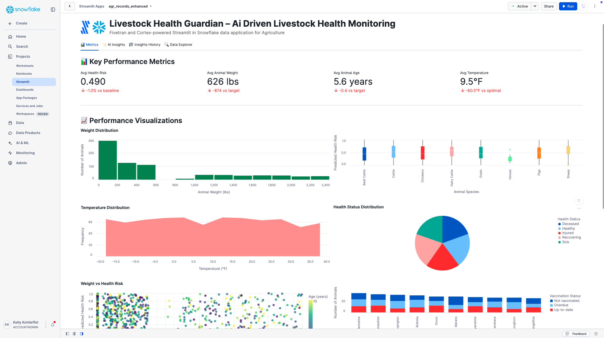

# Livestock Health Guardian – AI-driven Livestock Health Monitoring

A Fivetran and Cortex-powered Streamlit in Snowflake data application for Agriculture.

## Overview

Livestock Health Guardian is an AI-driven livestock health monitoring system that helps agricultural operations automate the early detection and prevention of livestock health issues, reducing the risk of disease outbreaks and improving overall animal welfare. This Streamlit in Snowflake data application helps farm managers, veterinarians, and livestock owners reduce treatment failures, decrease veterinary costs, increase animal productivity, and reduce antibiotic usage through real-time analysis of livestock health and environmental data.

The application utilizes a synthetic agriculture dataset that simulates data from farm management software, livestock health records, and weather monitoring systems. This synthetic data is moved into Snowflake using a custom connector built with the Fivetran Connector SDK, enabling reliable and efficient data pipelines for agricultural livestock monitoring analytics.

## Data Sources

The application is designed to work with data from major agricultural and livestock management systems:

### Agriculture Data Sources (Simulated)
- **Farm Management Software**: 
  - Granular
  - Trimble Ag
  - Climate FieldView
- **Livestock Health Records**: 
  - Zoetis
  - Merck Animal Health
  - Elanco
- **Weather Data**: 
  - The Weather Company
  - AccuWeather
  - DTN

For demonstration and development purposes, we've created a synthetic dataset that approximates these data sources and combined them into a single table exposed through an API server. This approach allows for realistic agricultural livestock monitoring analytics without using proprietary farm operations data.

## Key Features

- **AI-driven livestock health monitoring**: Leverages generative AI to analyze animal health data and automatically generate health assessments with predictive insights
- **Integration with synthetic agriculture data**: Simulates data from major farm management platforms, livestock health systems, and weather monitoring services
- **Comprehensive data application**: Visual representation of key metrics including health risk scores, animal weights, environmental conditions, and vaccination status
- **AI-powered insights**: Generate in-depth analysis of overall performance, optimization opportunities, financial impact, and strategic recommendations
- **Custom Fivetran connector**: Utilizes a custom connector built with the Fivetran Connector SDK to reliably move data from the API server to Snowflake

## Streamlit Data App Sections

### 📊 Metrics
- **Key Performance Indicators**: Track health risk scores, animal weights, environmental conditions, and vaccination compliance
- **Livestock Analytics**: Monitor animal health status, breed performance, and environmental impact on livestock
- **Weight Distribution**: Visualize the distribution of animal weights across the herd
- **Health Risk Analysis**: Analyze health risk scores by animal species with boxplot visualizations
- **Temperature Trends**: Track environmental temperature patterns to identify optimal conditions
- **Health Status Distribution**: Review health status distribution across livestock populations
- **Weight vs Health Risk Correlation**: Map relationships between animal weight and predicted health risks
- **Vaccination Status**: Monitor vaccination compliance across different breeds to identify gaps

### ✨ AI Insights
Generate AI-powered insights with different focus areas:
- **Overall Performance**: Comprehensive analysis of the livestock health monitoring system
- **Optimization Opportunities**: Areas where livestock health monitoring and farm management efficiency can be improved
- **Financial Impact**: Cost-benefit analysis and ROI in agriculture terms
- **Strategic Recommendations**: Long-term strategic implications for digital transformation in agriculture

### 📁 Insights History
Access previously generated insights for reference and comparison.

### 🔍 Data Explorer
Explore the underlying livestock data with pagination controls.

## Setup Instructions

1. Within Snowflake, click on **Projects**
2. Click on **Streamlit**
3. Click the blue box in the upper right to create a new Streamlit application
4. On the next page:
   - Name your application
   - **IMPORTANT:** Set the database context
   - **IMPORTANT:** Set the schema context

### Fivetran Data Movement Setup

1. Ensure the API server hosting the synthetic agriculture data is operational
2. Configure the custom Fivetran connector (built with Fivetran Connector SDK) to connect to the API server - debug and deploy
3. Start the Fivetran sync in the Fivetran UI to move data into an `AGR_RECORDS` table in your Snowflake instance
4. Verify data is being loaded correctly by checking the table in Snowflake

## Data Flow

1. **Synthetic Data Creation**: A synthetic dataset approximating real agricultural livestock monitoring data sources has been created and exposed via an API server:
   - Farm Management Software: Granular, Trimble Ag, Climate FieldView
   - Livestock Health Records: Zoetis, Merck Animal Health, Elanco
   - Weather Data: The Weather Company, AccuWeather, DTN

2. **Custom Data Integration**: A custom connector built with the Fivetran Connector SDK communicates with the API server to extract the synthetic agriculture livestock data

3. **Automated Data Movement**: Fivetran manages the orchestration and scheduling of data movement from the API server into Snowflake

4. **Data Loading**: The synthetic agriculture data is loaded into Snowflake as an `AGR_RECORDS` table in a structured format ready for analysis

5. **Data Analysis**: Snowpark for Python and Snowflake Cortex analyze the data to generate insights

6. **Data Visualization**: Streamlit in Snowflake presents the analyzed data in an interactive data application

## Data Requirements

The application expects a table named `AGR_RECORDS` which contains synthetic data simulating various agricultural livestock monitoring systems. This data is retrieved from an API server using a custom Fivetran connector built with the Fivetran Connector SDK:

### Livestock Data
- `record_id`
- `animal_id`
- `farm_id`
- `species`
- `breed`
- `health_status`
- `vaccination_history`
- `medication_history`
- `recommended_action`

### Performance Metrics
- `age`
- `weight`
- `predicted_health_risk`
- `temperature`
- `humidity`
- `precipitation`
- `weather_data`

## Benefits

- **300 fewer failed treatments per year**: 10,000 animals × 3% baseline treatment failure rate × 10% reduction = 300 fewer failed treatments/year
- **$1,200,000 in reduced veterinary costs annually**: $4,000,000 annual veterinary costs × 30% reduction = $1,200,000 savings/year
- **20% increase in animal productivity**: 80,000 animals × 20% baseline productivity rate × 20% improvement = 32,000 additional units/year
- **15% reduction in antibiotic usage**: 10,000 animals × 15% baseline antibiotic usage rate × 15% reduction = 1,500 fewer antibiotic treatments/year

## Technical Details

This application uses:
- Streamlit in Snowflake for the user interface
- Snowflake Cortex for AI-powered insights generation
- Multiple AI models including Claude 4 Sonnet, Claude 3.5 Sonnet, Llama 3.1/3.3, Mistral, DeepSeek, and more
- Snowpark for Python for data processing
- **Fivetran Connector SDK** for building a custom connector to retrieve synthetic agriculture livestock data from an API server
- **Custom Fivetran connector** for automated, reliable data movement into Snowflake

## Success Metrics

- Reduction in treatment failures
- Decrease in veterinary costs
- Increase in animal productivity
- Reduction in antibiotic usage

## Key Stakeholders

- Farm Managers
- Veterinarians
- Livestock Owners
- C-level Executive: CEO of the farm or agricultural company

## Competitive Advantage

Livestock Health Guardian differentiates itself through its use of advanced generative AI algorithms, enabling early detection of health issues and personalized recommendations for each animal. This creates a competitive advantage by reducing the risk of disease outbreaks and improving animal welfare, while providing real-time monitoring of vital signs and behavior with seamless integration to farm management software.

## Long-term Evolution

In the next 3-5 years, Livestock Health Guardian will evolve to incorporate more advanced generative AI techniques, such as multimodal learning and transfer learning, to further improve its predictive capabilities and adapt to new data sources and farm management practices. The system will expand to include integration with emerging agricultural technologies like IoT sensors, precision agriculture, and automated feeding systems for comprehensive livestock health management.