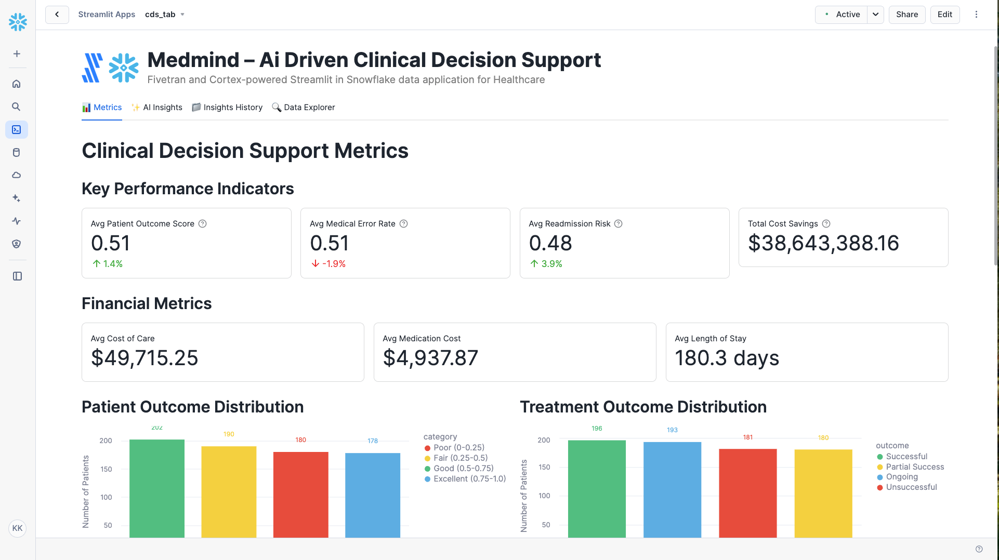

# MedMind – AI-driven Clinical Decision Support for Healthcare

A Fivetran and Cortex-powered Streamlit in Snowflake data application for Healthcare.

## Overview

MedMind is an AI-driven clinical decision support system that transforms patient care with data-driven insights. This Streamlit in Snowflake data application helps healthcare providers reduce medical errors and improve patient outcomes through real-time analysis of patient data and personalized treatment recommendations.

The application utilizes a synthetic healthcare dataset that simulates data from major EHR systems, clinical trials databases, and medical literature repositories. This synthetic data is moved into Snowflake using a custom connector built with the Fivetran Connector SDK, enabling reliable and efficient data pipelines for healthcare analytics.

## Data Sources

The application is designed to work with data from major healthcare systems and databases:

### Healthcare Data Sources (Simulated)
- **Electronic Health Records (EHRs)**: 
  - Epic Systems Corporation
  - Cerner
  - Meditech
- **Clinical Trials**: 
  - ClinicalTrials.gov
  - National Institutes of Health (NIH)
- **Medical Literature**: 
  - PubMed
  - National Library of Medicine

For demonstration and development purposes, we've created a synthetic dataset that approximates these data sources and combined them into a single table exposed through an API server. This approach allows for realistic healthcare analytics without using protected health information (PHI).

## Key Features

- **AI-driven clinical decision support system**: Leverages generative AI to analyze patient data and provide personalized treatment recommendations
- **Integration with synthetic healthcare data**: Simulates data from major EHR systems, clinical trials, and medical literature
- **Comprehensive data application**: Visual representation of key metrics including patient outcomes, treatment success rates, and financial impact
- **AI-powered insights**: Generate in-depth analysis of clinical performance, optimization opportunities, financial impact, and strategic recommendations
- **Custom Fivetran connector**: Utilizes a custom connector built with the Fivetran Connector SDK to reliably move data from the API server to Snowflake

## Streamlit Data App Sections

### 📊 Metrics
- **Key Performance Indicators**: Track patient outcome scores, medical error rates, readmission risks, and cost savings
- **Financial Metrics**: Monitor cost of care, medication costs, and length of stay
- **Patient Outcome Distribution**: Visualize the distribution of patient outcomes from poor to excellent
- **Treatment Outcome Distribution**: See the breakdown of treatment success rates
- **Patient Satisfaction**: Track patient satisfaction levels
- **Clinical Metrics**: Analyze top diagnoses and treatment plan distribution

### ✨ AI Insights
Generate AI-powered insights with different focus areas:
- **Overall Performance**: Comprehensive analysis of the clinical decision support system
- **Optimization Opportunities**: Areas where clinical decision support can be improved
- **Financial Impact**: Cost-benefit analysis and ROI in healthcare terms
- **Strategic Recommendations**: Long-term strategic implications for improvement

### 📁 Insights History
Access previously generated insights for reference and comparison.

### 🔍 Data Explorer
Explore the underlying data with pagination controls.

## Setup Instructions

1. Within Snowflake, click on **Projects**
2. Click on **Streamlit**
3. Click the blue box in the upper right to create a new Streamlit application
4. On the next page:
   - Name your application
   - **IMPORTANT:** Set the database context
   - **IMPORTANT:** Set the schema context

### Fivetran Data Movement Setup

1. Ensure the API server hosting the synthetic healthcare data is operational
2. Configure the custom Fivetran connector (built with Fivetran Connector SDK) to connect to the API server - debug and deploy
3. Start the Fivetran sync in the Fivetran UI to move data into a `CDS_RECORDS` table in your Snowflake instance
4. Verify data is being loaded correctly by checking the table in Snowflake

## Data Flow

1. **Synthetic Data Creation**: A synthetic dataset approximating real healthcare data sources has been created and exposed via an API server:
   - Electronic Health Records (EHRs): Epic Systems Corporation, Cerner, Meditech
   - Clinical Trials: ClinicalTrials.gov, National Institutes of Health (NIH)
   - Medical Literature: PubMed, National Library of Medicine

2. **Custom Data Integration**: A custom connector built with the Fivetran Connector SDK communicates with the API server to extract the synthetic healthcare data

3. **Automated Data Movement**: Fivetran manages the orchestration and scheduling of data movement from the API server into Snowflake

4. **Data Loading**: The synthetic healthcare data is loaded into Snowflake as a `CDS_RECORDS` table in a structured format ready for analysis

5. **Data Analysis**: Snowpark for Python and Snowflake Cortex analyze the data to generate insights

6. **Data Visualization**: Streamlit in Snowflake presents the analyzed data in an interactive data application

## Data Requirements

The application expects a table named `CDS_RECORDS` which contains synthetic data simulating various healthcare systems. This data is retrieved from an API server using a custom Fivetran connector built with the Fivetran Connector SDK:

### Patient Data
- `patient_id`
- `medical_history`
- `current_medications`
- `lab_results`
- `vital_signs`
- `diagnosis`
- `treatment_plan`

### Clinical Trial Data
- `clinical_trial_id`
- `trial_name`
- `trial_status`

### Medical Literature
- `medical_publication_id`
- `publication_title`
- `publication_date`

### Patient Metrics
- `medication_side_effects`
- `allergies`
- `medical_conditions`
- `family_medical_history`
- `genetic_data`
- `treatment_outcome`
- `medication_adherence`
- `patient_satisfaction`
- `medication_recommendation`
- `treatment_recommendation`

### Performance Metrics
- `readmission_risk`
- `medical_error_rate`
- `patient_outcome_score`
- `cost_of_care`
- `length_of_stay`
- `medication_cost`
- `total_cost_savings`

## Benefits

- 10% reduction in medical errors: 1,000 fewer medical errors/year
- 15% improvement in patient outcomes: 300 fewer complications/year
- 20% reduction in hospital readmissions: 200 fewer readmissions/year
- 5% reduction in healthcare costs: $500,000 savings/year

## Technical Details

This application uses:
- Streamlit in Snowflake for the user interface
- Snowflake Cortex for AI-powered insights generation
- Multiple AI models including Llama 3.1/3.3, Mistral, Claude, and more
- Snowpark for Python for data processing
- **Fivetran Connector SDK** for building a custom connector to retrieve synthetic healthcare data from an API server
- **Custom Fivetran connector** for automated, reliable data movement into Snowflake