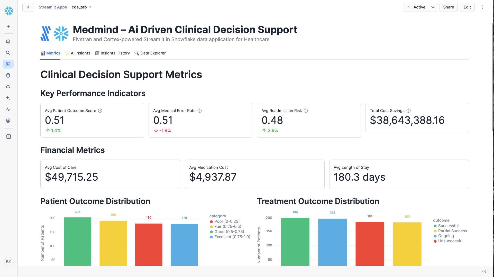

# MedMind – AI-driven Clinical Decision Support

A Fivetran and Cortex-powered Streamlit in Snowflake data application for Healthcare with advanced AI Agent Workflows.

## Overview

MedMind is an AI-driven clinical decision support system that transforms patient care with data-driven insights. This Streamlit in Snowflake data application helps healthcare providers reduce medical errors and improve patient outcomes through real-time analysis of patient data and personalized treatment recommendations.

The application features sophisticated AI Agent Workflows that provide transparent, step-by-step analysis of healthcare data, transforming complex clinical insights into actionable care strategies. Each analysis focus area operates through specialized mini-agents that simulate the decision-making process of experienced healthcare professionals and clinical experts.

The application utilizes a synthetic healthcare dataset that simulates data from major EHR systems, clinical trials databases, and medical literature repositories. This synthetic data is moved into Snowflake using a custom connector built with the Fivetran Connector SDK, enabling reliable and efficient data pipelines for healthcare analytics.

## AI Agent Workflows

### Agent Architecture Overview

MedMind employs a sophisticated multi-agent architecture designed specifically for healthcare analysis. Each focus area operates through specialized AI agents that break down complex clinical decision support tasks into transparent, sequential steps that mirror the thought processes of experienced clinicians and healthcare consultants.

### Focus Area Agents

#### Overall Performance Agent
**Business Challenge**: Care coordinators manually review dozens of hospital discharge reports daily, spending 2+ hours identifying high-risk patients who need immediate intervention to prevent readmission.

**Agent Solution**: Autonomous workflow that analyzes recent discharges, assesses readmission risks, identifies care gaps, and generates prioritized intervention plans in a fraction of the time normally required.

**Agent Workflow Steps**:
1. **Clinical Data Initialization** - Loading comprehensive patient dataset with enhanced validation and quality checks across patient records
2. **Performance Metrics Assessment** - Advanced calculation of key performance indicators with clinical effectiveness analysis
3. **Clinical Pattern Recognition** - Sophisticated identification of clinical patterns with evidence-based analysis across treatment outcomes
4. **AI Clinical Intelligence Processing** - Processing comprehensive clinical data through selected AI model with advanced reasoning
5. **Report Compilation** - Professional clinical performance analysis with evidence-based recommendations and actionable insights

#### Optimization Opportunities Agent
**Business Challenge**: Care coordinators spend 3+ hours daily manually identifying workflow inefficiencies and optimization opportunities across treatment plans and medication protocols.

**Agent Solution**: AI-powered analysis that automatically detects care coordination gaps, medication optimization opportunities, and EHR integration improvements with specific implementation recommendations.

**Agent Workflow Steps**:
1. **Optimization Data Preparation** - Advanced loading of clinical workflow data with enhanced validation for improvement opportunity identification
2. **Clinical Inefficiency Detection** - Sophisticated analysis of treatment plans and medication recommendations with evidence-based inefficiency identification
3. **Clinical Correlation Analysis** - Enhanced examination of relationships between medication adherence, outcomes, and satisfaction
4. **EHR Integration Optimization** - Comprehensive evaluation of clinical decision support integration with existing EHR workflows
5. **AI Optimization Intelligence** - Generating advanced optimization recommendations using selected AI model with clinical reasoning
6. **Strategy Finalization** - Professional optimization report with prioritized implementation roadmap and clinical impact analysis

#### Financial Impact Agent
**Business Challenge**: Financial analysts manually calculate ROI and cost-benefit metrics across patient populations, requiring 2+ hours of complex financial modeling and reporting.

**Agent Solution**: Automated financial analysis that calculates comprehensive ROI, identifies cost reduction opportunities, and projects value-based care benefits with detailed financial forecasting.

**Agent Workflow Steps**:
1. **Financial Data Integration** - Advanced loading of cost data and healthcare financial metrics with enhanced validation across patients
2. **Cost-Benefit Calculation** - Sophisticated ROI metrics calculation with healthcare cost savings analysis
3. **Revenue Impact Assessment** - Enhanced analysis of healthcare revenue impact with value-based care metrics and clinical outcome financial correlation
4. **Resource Efficiency Analysis** - Comprehensive evaluation of resource allocation efficiency across treatment plans with length of stay optimization
5. **AI Financial Modeling** - Advanced financial projections and ROI calculations using selected AI model with comprehensive cost-benefit analysis
6. **Financial Report Generation** - Professional financial impact analysis with detailed ROI calculations and value-based care forecasting

#### Strategic Recommendations Agent
**Business Challenge**: Healthcare executives spend hours manually analyzing competitive positioning and developing strategic technology roadmaps for clinical decision support advancement.

**Agent Solution**: Strategic intelligence workflow that analyzes competitive advantages, identifies technology integration opportunities, and creates prioritized implementation roadmaps for long-term growth.

**Agent Workflow Steps**:
1. **Strategic Data Assessment** - Advanced loading of strategic context with competitive positioning analysis across patients and diagnosis categories
2. **Competitive Advantage Analysis** - Sophisticated evaluation of competitive positioning against traditional clinical decision support with MedMind effectiveness analysis
3. **Future Technology Integration** - Enhanced analysis of integration opportunities with genetic data, wearables, and telemedicine across data dimensions
4. **Clinical Implementation Strategy** - Comprehensive development of prioritized clinical implementation roadmap with evidence-based adoption strategies
5. **AI Strategic Processing** - Advanced strategic recommendations using selected AI model with long-term competitive positioning and market analysis
6. **Strategic Report Generation** - Professional strategic roadmap with competitive analysis and clinical implementation plan ready for executive review

### Agent Execution Flow

1. **Agent Initialization** - User selects focus area and AI model, triggering specialized agent activation
2. **Data Context Loading** - Agent accesses patient data, clinical outcomes, and healthcare financial metrics
3. **Step-by-Step Processing** - Agent executes sequential workflow steps with real-time progress visualization
4. **Clinical Intelligence Integration** - Selected Snowflake Cortex model processes healthcare context with specialized prompting
5. **Results Compilation** - Agent generates comprehensive clinical analysis with actionable healthcare recommendations
6. **Report Delivery** - Professional healthcare report delivered with implementation roadmap and success metrics

## Data Sources

The application is designed to work with data from major healthcare systems and databases:

### Healthcare Data Sources (Simulated)
- **Electronic Health Records (EHRs)**: 
  - Epic Systems Corporation
  - Cerner
  - Meditech
- **Clinical Trials**: 
  - ClinicalTrials.gov
  - National Institutes of Health (NIH)
- **Medical Literature**: 
  - PubMed
  - National Library of Medicine

For demonstration and development purposes, we've created a synthetic dataset that approximates these data sources and combined them into a single table exposed through an API server. This approach allows for realistic healthcare analytics without using protected health information (PHI).

## Key Features

- **AI Agent Workflows**: Transparent, step-by-step healthcare analysis through specialized mini-agents for each focus area
- **Agent Progress Visualization**: Real-time display of agent processing steps with clinical context and completion tracking
- **Focus Area Specialization**: Dedicated agents for Overall Performance, Optimization Opportunities, Financial Impact, and Strategic Recommendations
- **Clinical Intelligence Integration**: Seamless integration with multiple Snowflake Cortex models for specialized healthcare analysis
- **AI-driven clinical decision support system**: Leverages generative AI to analyze patient data and provide personalized treatment recommendations
- **Integration with synthetic healthcare data**: Simulates data from major EHR systems, clinical trials, and medical literature
- **Comprehensive data application**: Visual representation of key metrics including patient outcomes, treatment success rates, and financial impact
- **Custom Fivetran connector**: Utilizes a custom connector built with the Fivetran Connector SDK to reliably move data from the API server to Snowflake

## Streamlit Data App Sections

### Metrics
- **Key Performance Indicators**: Track patient outcome scores, medical error rates, readmission risks, and cost savings
- **Financial Metrics**: Monitor cost of care, medication costs, and length of stay
- **Patient Outcome Distribution**: Visualize the distribution of patient outcomes from poor to excellent
- **Treatment Outcome Distribution**: See the breakdown of treatment success rates
- **Patient Satisfaction**: Track patient satisfaction levels
- **Clinical Metrics**: Analyze top diagnoses and treatment plan distribution

### AI Insights with Agent Workflows
Generate AI-powered insights through transparent agent workflows with different focus areas:
- **Overall Performance**: Comprehensive analysis of the clinical decision support system through autonomous workflow for care coordination
- **Optimization Opportunities**: Areas where clinical decision support can be improved via AI-powered analysis of care coordination gaps
- **Financial Impact**: Cost-benefit analysis and ROI in healthcare terms through automated financial analysis
- **Strategic Recommendations**: Long-term strategic implications for improvement via strategic intelligence workflow

Each focus area includes:
- **Business Challenge Description**: Detailed explanation of the specific healthcare problem being addressed
- **Agent Solution Overview**: Description of how the AI agent workflow solves the challenge
- **Real-time Progress Tracking**: Step-by-step visualization of agent processing with clinical context
- **Agent Execution Controls**: Start/stop controls for managing agent workflow execution
- **Professional Healthcare Reports**: Comprehensive analysis reports with implementation roadmaps

### Insights History
Access previously generated agent-driven insights for reference and comparison, including agent execution details and model selection.

### Data Explorer
Explore the underlying data with pagination controls.

## Setup Instructions

1. Within Snowflake, click on **Projects**
2. Click on **Streamlit**
3. Click the blue box in the upper right to create a new Streamlit application
4. On the next page:
   - Name your application
   - **IMPORTANT:** Set the database context
   - **IMPORTANT:** Set the schema context

### Fivetran Data Movement Setup

1. Ensure the API server hosting the synthetic healthcare data is operational
2. Configure the custom Fivetran connector (built with Fivetran Connector SDK) to connect to the API server - debug and deploy
3. Start the Fivetran sync in the Fivetran UI to move data into a `CDS_RECORDS` table in your Snowflake instance
4. Verify data is being loaded correctly by checking the table in Snowflake

## Data Flow

1. **Synthetic Data Creation**: A synthetic dataset approximating real healthcare data sources has been created and exposed via an API server:
   - Electronic Health Records (EHRs): Epic Systems Corporation, Cerner, Meditech
   - Clinical Trials: ClinicalTrials.gov, National Institutes of Health (NIH)
   - Medical Literature: PubMed, National Library of Medicine

2. **Custom Data Integration**: A custom connector built with the Fivetran Connector SDK communicates with the API server to extract the synthetic healthcare data

3. **Automated Data Movement**: Fivetran manages the orchestration and scheduling of data movement from the API server into Snowflake

4. **Data Loading**: The synthetic healthcare data is loaded into Snowflake as a `CDS_RECORDS` table in a structured format ready for analysis

5. **Agent Workflow Execution**: AI agents process the healthcare data through specialized workflows, providing transparent step-by-step analysis

6. **Data Analysis**: Snowpark for Python and Snowflake Cortex analyze the data to generate insights through agent-driven processes

7. **Data Visualization**: Streamlit in Snowflake presents the analyzed data in an interactive data application with agent workflow visualization

## Data Requirements

The application expects a table named `CDS_RECORDS` which contains synthetic data simulating various healthcare systems. This data is retrieved from an API server using a custom Fivetran connector built with the Fivetran Connector SDK:

### Patient Data
- `patient_id`
- `medical_history`
- `current_medications`
- `lab_results`
- `vital_signs`
- `diagnosis`
- `treatment_plan`

### Clinical Trial Data
- `clinical_trial_id`
- `trial_name`
- `trial_status`

### Medical Literature
- `medical_publication_id`
- `publication_title`
- `publication_date`

### Patient Metrics
- `medication_side_effects`
- `allergies`
- `medical_conditions`
- `family_medical_history`
- `genetic_data`
- `treatment_outcome`
- `medication_adherence`
- `patient_satisfaction`
- `medication_recommendation`
- `treatment_recommendation`

### Performance Metrics
- `readmission_risk`
- `medical_error_rate`
- `patient_outcome_score`
- `cost_of_care`
- `length_of_stay`
- `medication_cost`
- `total_cost_savings`

## Benefits

- 10% reduction in medical errors: 1,000 fewer medical errors/year
- 15% improvement in patient outcomes: 300 fewer complications/year
- 20% reduction in hospital readmissions: 200 fewer readmissions/year
- 5% reduction in healthcare costs: $500,000 savings/year
- **Enhanced Clinical Transparency**: Agent workflows provide clear visibility into healthcare analysis reasoning and clinical decision-making processes
- **Accelerated Care Coordination**: Automated agent processing reduces manual analysis time from hours to minutes for complex patient assessments

## Technical Details

This application uses:
- **AI Agent Workflow Engine**: Custom agent orchestration system for transparent, step-by-step healthcare analysis
- **Multi-Agent Architecture**: Specialized agents for different healthcare focus areas with domain-specific processing
- **Agent Progress Visualization**: Real-time display of agent execution steps with clinical context and completion tracking
- **Streamlit in Snowflake** for the user interface with enhanced agent workflow displays
- **Snowflake Cortex** for AI-powered insights generation through agent-managed prompting
- **Multiple AI models** including Claude 4 Sonnet, Claude 3.5 Sonnet, Llama 3.1/3.3, Mistral, DeepSeek, and more for agent intelligence
- **Snowpark for Python** for data processing within agent workflows
- **Fivetran Connector SDK** for building a custom connector to retrieve synthetic healthcare data from an API server
- **Custom Fivetran connector** for automated, reliable data movement into Snowflake

## Success Metrics

- Reduction in medical errors
- Improvement in patient outcomes
- Reduction in hospital readmissions
- Reduction in healthcare costs
- **Agent Workflow Efficiency**: Time reduction from manual healthcare analysis to automated agent-driven insights
- **Clinical Decision Transparency Score**: User confidence in healthcare recommendations through visible agent reasoning
- **Healthcare Analysis Accuracy**: Improvement in clinical decision quality through systematic agent processing

## Key Stakeholders

- Chief Medical Officer
- Chief Information Officer
- Clinical Decision Support Teams
- **Healthcare Data Analysts**: Professionals who benefit from transparent agent workflow visibility
- **Care Coordination Teams**: Staff who implement agent-recommended patient care strategies

## Competitive Advantage

MedMind differentiates itself from traditional clinical decision support systems by leveraging generative AI with transparent agent workflows to analyze vast amounts of patient data and provide personalized treatment recommendations. The agent-based architecture provides unprecedented visibility into clinical analysis reasoning, building trust and confidence in AI-driven healthcare decisions. This creates a competitive advantage by reducing medical errors, improving patient outcomes, and providing real-time clinical insights while maintaining complete transparency in the decision-making process.

## Long-term Evolution

In the next 3-5 years, MedMind will evolve to incorporate more advanced generative AI techniques and sophisticated agent architectures, including:

- **Multi-modal Agent Learning**: Agents that can process medical imaging, lab results, and clinical notes from diverse healthcare systems
- **Collaborative Agent Networks**: Multiple agents working together to solve complex clinical challenges across different patient populations
- **Adaptive Agent Intelligence**: Self-improving agents that learn from clinical outcomes and refine their analytical approaches
- **Advanced Agent Orchestration**: Sophisticated workflow management for complex, multi-step clinical analysis processes
- **Integration with Emerging Healthcare Technologies**: Agent connectivity with wearable devices, telemedicine platforms, genomic data, and personalized medicine for comprehensive clinical decision support

The system will expand to include integration with wearable devices, telemedicine, and personalized medicine, all orchestrated through advanced agent workflows that provide complete transparency and control over the clinical analysis process.