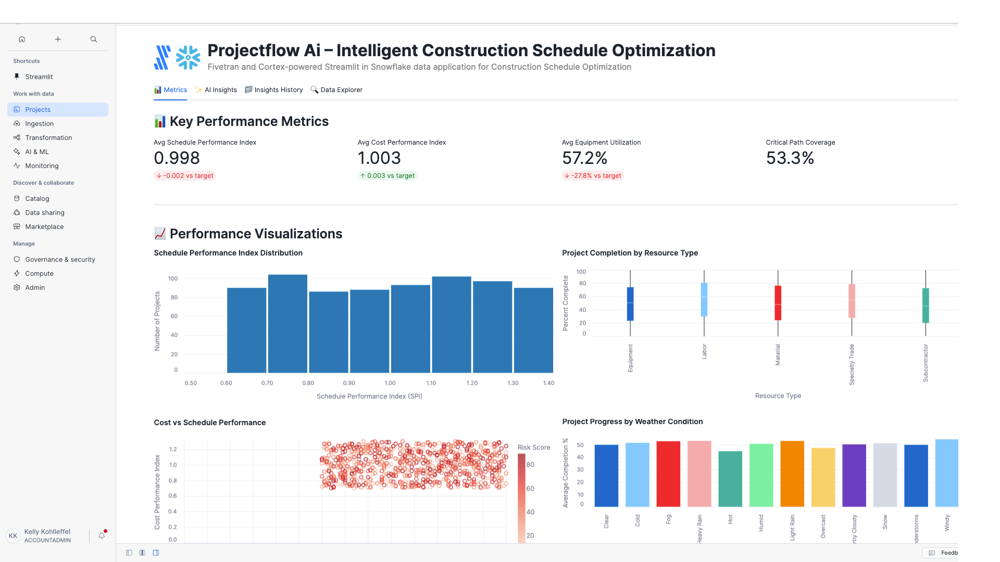

# ProjectFlow AI – Intelligent Construction Schedule Optimization

A Fivetran and Cortex-powered Streamlit in Snowflake data application for Construction Schedule Optimization.

## Overview

ProjectFlow AI is an intelligent construction schedule optimization system that helps construction companies automate the complex and time-consuming process of creating accurate project schedules across multiple time horizons. This Streamlit in Snowflake data application helps Chief Operating Officers, Project Managers, and construction directors reduce project delays, minimize cost overruns, optimize resource allocation, and improve schedule performance through real-time analysis of project management, resource allocation, and operational data.

The application utilizes a synthetic construction dataset that simulates data from project management platforms, enterprise resource planning systems, weather forecasting services, and equipment management databases. This synthetic data is moved into Snowflake using a custom connector built with the Fivetran Connector SDK, enabling reliable and efficient data pipelines for construction schedule optimization analytics.

## Data Sources

The application is designed to work with data from major construction and project management systems:

### Construction Data Sources (Simulated)
- **Project Management Platforms**: 
  - Microsoft Project
  - Primavera P6
  - Smartsheet
- **Enterprise Resource Planning (ERP)**: 
  - SAP
  - Oracle Construction and Engineering
  - Sage 300 CRE
- **Weather Forecasting**: 
  - The Weather Channel
  - DTN
  - Weatherzone
- **Supply Chain Management**: 
  - Oracle SCM
  - SAP Ariba
  - Coupa
- **Equipment Management**: 
  - B2W Software
  - HCSS Equipment360
  - Fleetio

For demonstration and development purposes, we've created a synthetic dataset that approximates these data sources and combined them into a single table exposed through an API server. This approach allows for realistic construction schedule optimization analytics without using proprietary project management data.

## Key Features

- **AI-powered dynamic schedule optimization**: Leverages generative AI to analyze project patterns and automatically generate optimized schedules based on real-time project conditions
- **Integration with synthetic construction data**: Simulates data from major project management platforms, ERP systems, and weather forecasting sources
- **Comprehensive construction analytics**: Visual representation of key metrics including schedule performance index, cost performance index, resource utilization rates, and critical path optimization
- **AI-powered insights**: Generate in-depth analysis of overall performance, optimization opportunities, financial impact, and strategic recommendations
- **Custom Fivetran connector**: Utilizes a custom connector built with the Fivetran Connector SDK to reliably move data from the API server to Snowflake

## Streamlit Data App Sections

### 📊 Metrics
- **Key Performance Indicators**: Track schedule performance index (SPI), cost performance index (CPI), equipment utilization rates, and critical path coverage
- **Construction Analytics**: Monitor project completion rates, resource allocation efficiency, and weather impact analysis
- **Schedule Performance Analysis**: Visualize SPI distribution across projects and identify scheduling bottlenecks
- **Resource Management**: Analyze resource utilization by type with detailed cost breakdowns
- **Weather Impact**: Track weather condition effects on project progress and completion rates
- **Equipment Utilization**: Monitor equipment utilization distribution to identify optimization opportunities
- **Critical Path Analysis**: Review critical path task status to identify potential delays
- **Risk Assessment**: Analyze risk scores versus resource availability to proactively manage project risks

### ✨ AI Insights
Generate AI-powered insights with different focus areas:
- **Overall Performance**: Comprehensive analysis of the construction schedule optimization and project management system
- **Optimization Opportunities**: Areas where schedule efficiency, resource allocation, and project delivery can be improved
- **Financial Impact**: Cost-benefit analysis and ROI in construction terms (project cost savings vs. schedule optimization improvements)
- **Strategic Recommendations**: Long-term strategic implications for digital transformation in construction project management

### 📁 Insights History
Access previously generated insights for reference and comparison.

### 🔍 Data Explorer
Explore the underlying construction project management data with pagination controls.

## Setup Instructions

1. Within Snowflake, click on **Projects**
2. Click on **Streamlit**
3. Click the blue box in the upper right to create a new Streamlit application
4. On the next page:
   - Name your application
   - **IMPORTANT:** Set the database context
   - **IMPORTANT:** Set the schema context

### Fivetran Data Movement Setup

1. Ensure the API server hosting the synthetic construction data is operational
2. Configure the custom Fivetran connector (built with Fivetran Connector SDK) to connect to the API server - debug and deploy
3. Start the Fivetran sync in the Fivetran UI to move data into a `CON_RECORDS` table in your Snowflake instance
4. Verify data is being loaded correctly by checking the table in Snowflake

## Data Flow

1. **Synthetic Data Creation**: A synthetic dataset approximating real construction project management data sources has been created and exposed via an API server:
   - Project Management Platforms: Microsoft Project, Primavera P6, Smartsheet
   - Enterprise Resource Planning: SAP, Oracle Construction and Engineering, Sage 300 CRE
   - Weather Forecasting: The Weather Channel, DTN, Weatherzone

2. **Custom Data Integration**: A custom connector built with the Fivetran Connector SDK communicates with the API server to extract the synthetic construction project management data

3. **Automated Data Movement**: Fivetran manages the orchestration and scheduling of data movement from the API server into Snowflake

4. **Data Loading**: The synthetic construction data is loaded into Snowflake as a `CON_RECORDS` table in a structured format ready for analysis

5. **Data Analysis**: Snowpark for Python and Snowflake Cortex analyze the data to generate insights

6. **Data Visualization**: Streamlit in Snowflake presents the analyzed data in an interactive data application

## Data Requirements

The application expects a table named `CON_RECORDS` which contains synthetic data simulating various construction project management systems. This data is retrieved from an API server using a custom Fivetran connector built with the Fivetran Connector SDK:

### Project Identifiers
- `RECORD_ID`
- `PROJECT_ID`
- `TASK_ID`

### Project Information
- `PROJECT_NAME`
- `TASK_NAME`
- `SCHEDULED_START_DATE`
- `SCHEDULED_END_DATE`
- `ACTUAL_START_DATE`
- `ACTUAL_END_DATE`
- `TASK_STATUS`
- `PERCENT_COMPLETE`
- `CRITICAL_PATH_FLAG`

### Resource Management Data
- `RESOURCE_ID`
- `RESOURCE_TYPE`
- `RESOURCE_AVAILABILITY`
- `RESOURCE_COST_PER_HOUR`

### Weather and Environmental Data
- `WEATHER_CONDITION`
- `TEMPERATURE_FAHRENHEIT`
- `PRECIPITATION_PROBABILITY`
- `WIND_SPEED_MPH`

### Supply Chain and Equipment Data
- `SUPPLIER_ID`
- `MATERIAL_DELIVERY_DATE`
- `MATERIAL_DELIVERY_STATUS`
- `EQUIPMENT_ID`
- `EQUIPMENT_STATUS`
- `EQUIPMENT_UTILIZATION_RATE`

### Performance Metrics
- `SCHEDULE_PERFORMANCE_INDEX`
- `COST_PERFORMANCE_INDEX`
- `RISK_SCORE`
- `DATA_TIMESTAMP`

## Benefits

- **45 fewer project delays per year**: 500 annual projects × 18% baseline delay rate × 50% reduction = 45 fewer delays/year
- **$3,600,000 in project cost savings annually**: $50,000,000 annual project costs × 12% typical overrun × 60% reduction = $3,600,000 savings/year
- **7,200 hours of improved resource utilization annually**: 60,000 total resource hours × 20% idle time × 60% reduction = 7,200 hours/year
- **$900,000 in penalty avoidance annually**: $12,000,000 potential annual penalties × 7.5% reduction = $900,000 penalty avoidance/year

## Technical Details

This application uses:
- Streamlit in Snowflake for the user interface
- Snowflake Cortex for AI-powered insights generation
- Multiple AI models including Claude 4 Sonnet, Claude 3.5 Sonnet, Llama 3.1/3.3, Mistral, DeepSeek, and more
- Snowpark for Python for data processing
- **Fivetran Connector SDK** for building a custom connector to retrieve synthetic construction project management data from an API server
- **Custom Fivetran connector** for automated, reliable data movement into Snowflake

## Success Metrics

- Schedule performance index (SPI) improvement
- Resource utilization rate enhancement
- Project completion variance from baseline reduction
- Critical path optimization effectiveness
- Stakeholder satisfaction scores improvement

## Key Stakeholders

- Primary: Project Managers, Construction Schedulers, Resource Coordinators
- Secondary: Operations Directors, Portfolio Managers, Construction Site Supervisors
- Tertiary: Subcontractors, Procurement Specialists, Quality Control Teams
- **Top C-Level Executive:** Chief Operating Officer (COO)

## Competitive Advantage

ProjectFlow AI provides dynamic, AI-driven schedule optimization that continuously adapts to changing conditions, unlike static traditional scheduling tools, enabling proactive decision-making and resource optimization that competitors cannot match. The system employs reinforcement learning algorithms for dynamic schedule optimization, natural language processing to analyze project communications and identify risks, and generative AI to create alternative scheduling scenarios and resource allocation strategies.

## Risk Assessment

**Challenges:** Data quality inconsistencies across systems, resistance to AI-driven scheduling changes, complexity of multi-project resource optimization

**Mitigation:** Implement data validation protocols, provide comprehensive change management training, start with pilot projects to demonstrate value

## Long-term Evolution

Development toward autonomous project orchestration with IoT integration for real-time equipment monitoring, expanded integration with emerging construction technologies like autonomous equipment management, and predictive analytics for supply chain disruption management. Over the next 3-5 years, ProjectFlow AI will continue to evolve by incorporating real-time IoT sensor data from construction sites, expanding to include dynamic resource pricing optimization, and integrating with emerging construction technologies like autonomous equipment coordination and predictive material logistics planning.