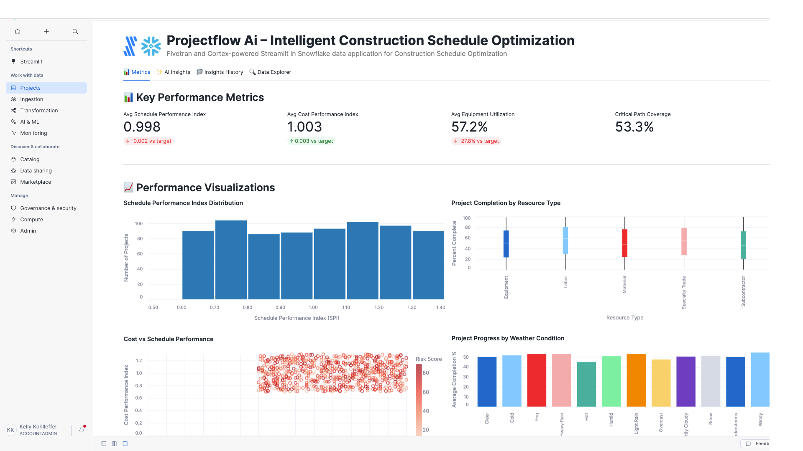

# ProjectFlow AI – Intelligent Construction Schedule Optimization

A Fivetran and Cortex-powered Streamlit in Snowflake data application for Construction Schedule Optimization with advanced AI Agent Workflows.

## Overview

ProjectFlow AI is an intelligent construction schedule optimization system that helps construction companies automate the manual and time-consuming process of analyzing project schedules, resource allocation, and performance metrics. This Streamlit in Snowflake data application helps Project Managers, Chief Operating Officers, and Construction Schedulers improve schedule performance indices, reduce project delays, minimize cost overruns, and accelerate project delivery through real-time analysis of construction project data.

The application features sophisticated AI Agent Workflows that provide transparent, step-by-step analysis of construction scheduling data, transforming complex project management models and resource optimization strategies into actionable construction insights and adaptive schedule recommendations. Each analysis focus area operates through specialized mini-agents that simulate the decision-making process of experienced project managers and construction optimization experts.

The application utilizes a synthetic construction dataset that simulates data from project management platforms, ERP systems, and weather forecasting services. This synthetic data is moved into Snowflake using a custom connector built with the Fivetran Connector SDK, enabling reliable and efficient data pipelines for construction schedule optimization analytics.

## AI Agent Workflows

### Agent Architecture Overview

ProjectFlow AI employs a sophisticated multi-agent architecture designed specifically for construction schedule optimization analysis. Each focus area operates through specialized AI agents that break down complex project management and resource allocation tasks into transparent, sequential steps that mirror the thought processes of experienced project managers and construction optimization professionals.

### Focus Area Agents

#### Overall Performance Agent
**Business Challenge**: Project Managers and Chief Operating Officers manually review hundreds of construction project schedules, resource allocations, and performance metrics daily, spending 4+ hours analyzing schedule performance indices, weather impacts, and equipment utilization to identify critical project bottlenecks and scheduling optimization opportunities.

**Agent Solution**: Autonomous construction scheduling workflow that analyzes project schedules, resource metrics, performance data, and weather conditions to generate automated project summaries, identify scheduling bottlenecks, and produce prioritized construction insights with adaptive schedule optimization recommendations.

**Agent Workflow Steps**:
1. **Construction Project Data Initialization** - Loading comprehensive construction scheduling dataset with enhanced validation across project records and resource allocations
2. **Schedule Performance Assessment** - Advanced calculation of construction scheduling indicators with performance analysis
3. **Construction Pattern Recognition** - Sophisticated identification of scheduling patterns with resource correlation analysis
4. **AI Construction Intelligence Processing** - Processing comprehensive construction data through selected AI model with advanced reasoning
5. **Construction Performance Report Compilation** - Professional construction scheduling analysis with evidence-based recommendations and actionable project insights

#### Optimization Opportunities Agent
**Business Challenge**: Construction Schedulers and Operations Directors spend 5+ hours daily manually identifying inefficiencies in project scheduling strategies, resource allocation criteria, and weather contingency planning across multiple construction projects and geographic locations.

**Agent Solution**: AI-powered construction scheduling optimization analysis that automatically detects schedule performance gaps, resource utilization inefficiencies, and project delivery improvements with specific implementation recommendations for Microsoft Project, Primavera P6, and SAP Construction system integration.

**Agent Workflow Steps**:
1. **Construction Optimization Data Preparation** - Advanced loading of construction scheduling data with enhanced validation for scheduling improvement identification
2. **Schedule Performance Inefficiency Detection** - Sophisticated analysis of construction scheduling strategies and resource performance with evidence-based inefficiency identification
3. **Construction Resource Correlation Analysis** - Enhanced examination of relationships between project types, weather conditions, and schedule performance rates
4. **ERP Integration Optimization** - Comprehensive evaluation of construction scheduling integration with existing Microsoft Project, Primavera P6, and SAP Construction systems
5. **AI Construction Intelligence** - Generating advanced construction optimization recommendations using selected AI model with scheduling reasoning
6. **Construction Strategy Finalization** - Professional construction optimization report with prioritized implementation roadmap and resource impact analysis

#### Financial Impact Agent
**Business Challenge**: Chief Operating Officers manually calculate complex ROI metrics across construction project activities and resource management performance, requiring 4+ hours of cost modeling to assess project efficiency and schedule optimization across the construction portfolio.

**Agent Solution**: Automated construction financial analysis that calculates comprehensive project scheduling ROI, identifies resource cost reduction opportunities across project categories, and projects schedule performance benefits with detailed construction cost forecasting.

**Agent Workflow Steps**:
1. **Construction Financial Data Integration** - Advanced loading of construction project financial data and resource cost metrics with enhanced validation across project records
2. **Construction Cost-Benefit Calculation** - Sophisticated ROI metrics calculation with resource analysis and construction scheduling efficiency cost savings
3. **Resource Management Impact Assessment** - Enhanced analysis of construction revenue impact with resource utilization metrics and schedule correlation analysis
4. **Construction Resource Efficiency Analysis** - Comprehensive evaluation of resource allocation efficiency across construction activities with project lifecycle cost optimization
5. **AI Construction Financial Modeling** - Advanced construction project financial projections and scheduling ROI calculations using selected AI model
6. **Construction Economics Report Generation** - Professional construction financial impact analysis with detailed project scheduling ROI calculations and resource cost forecasting

#### Strategic Recommendations Agent
**Business Challenge**: Chief Operating Officers spend hours manually analyzing digital transformation opportunities and developing strategic construction technology roadmaps for scheduling advancement and adaptive project management implementation across construction portfolios.

**Agent Solution**: Strategic construction scheduling intelligence workflow that analyzes competitive advantages against traditional project scheduling processes, identifies AI and adaptive scheduling integration opportunities, and creates prioritized digital construction transformation roadmaps.

**Agent Workflow Steps**:
1. **Construction Technology Assessment** - Advanced loading of construction scheduling digital context with competitive positioning analysis across project records and active projects
2. **Construction Competitive Advantage Analysis** - Sophisticated evaluation of competitive positioning against traditional project scheduling with AI-powered construction optimization effectiveness
3. **Advanced Construction Technology Integration** - Enhanced analysis of integration opportunities with IoT sensors, real-time weather data, and AI-powered construction sensing across project data dimensions
4. **Digital Construction Strategy Development** - Comprehensive development of prioritized digital transformation roadmap with evidence-based construction technology adoption strategies
5. **AI Construction Strategic Processing** - Advanced construction scheduling strategic recommendations using selected AI model with long-term competitive positioning
6. **Digital Construction Report Generation** - Professional digital construction transformation roadmap with competitive analysis and scheduling technology implementation plan ready for COO executive review

### Agent Execution Flow

1. **Agent Initialization** - User selects focus area and AI model, triggering specialized agent activation
2. **Data Context Loading** - Agent accesses project schedules, resource allocations, and performance metrics
3. **Step-by-Step Processing** - Agent executes sequential workflow steps with real-time progress visualization
4. **Construction Intelligence Integration** - Selected Snowflake Cortex model processes construction context with specialized prompting
5. **Results Compilation** - Agent generates comprehensive construction scheduling analysis with actionable project recommendations
6. **Report Delivery** - Professional construction report delivered with implementation roadmap and success metrics

## Data Sources

The application is designed to work with data from major construction project management systems:

### Construction Data Sources (Simulated)
- **Project Management Platforms**: 
  - Microsoft Project
  - Primavera P6
  - Smartsheet
- **Enterprise Resource Planning (ERP)**: 
  - SAP Construction and Engineering
  - Oracle Construction and Engineering
  - Sage 300 CRE
- **Weather Forecasting**: 
  - The Weather Channel API
  - DTN Weather Services
  - Weatherzone
- **Supply Chain Management**:
  - Oracle SCM Cloud
  - SAP Ariba
  - Coupa
- **Equipment Management**:
  - B2W Software
  - HCSS Equipment360
  - Fleetio
- **Resource Planning**:
  - Deltek
  - Viewpoint Vista
  - Foundation Software

For demonstration and development purposes, we've created a synthetic dataset that approximates these data sources and combined them into a single table exposed through an API server. This approach allows for realistic construction schedule optimization analytics without using proprietary project data.

## Key Features

- **AI Agent Workflows**: Transparent, step-by-step construction scheduling analysis through specialized mini-agents for each focus area
- **Agent Progress Visualization**: Real-time display of agent processing steps with construction context and completion tracking
- **Focus Area Specialization**: Dedicated agents for Overall Performance, Optimization Opportunities, Financial Impact, and Strategic Recommendations
- **Construction Intelligence Integration**: Seamless integration with multiple Snowflake Cortex models for specialized construction analysis
- **AI-powered construction schedule optimization**: Leverages generative AI to analyze project patterns and automatically generate optimized scheduling models with key insights
- **Integration with synthetic construction data**: Simulates data from major project management platforms, ERP systems, and weather forecasting providers
- **Comprehensive data application**: Visual representation of key metrics including schedule performance indices, resource utilization, equipment efficiency, and weather impacts
- **Custom Fivetran connector**: Utilizes a custom connector built with the Fivetran Connector SDK to reliably move data from the API server to Snowflake

## Streamlit Data App Sections

### Metrics
- **Key Performance Indicators**: Track Schedule Performance Index (SPI), Cost Performance Index (CPI), resource utilization, and equipment efficiency
- **Construction Analytics**: Monitor active projects, resource types, and construction scheduling efficiency
- **Schedule Performance Distribution**: Visualize schedule performance patterns across construction activities
- **Resource Analysis**: Analyze resource utilization by type with comprehensive visualizations
- **Weather Impact**: Track weather condition distribution and project effects
- **Equipment Trends**: Review equipment utilization distribution across project categories
- **Critical Path Analysis**: Monitor critical path coverage by location to identify high-risk projects
- **Risk Indicators**: Assess risk scores vs resource availability relationships

### AI Insights with Agent Workflows
Generate AI-powered insights through transparent agent workflows with different focus areas:
- **Overall Performance**: Comprehensive analysis of the construction scheduling and project optimization system through autonomous construction workflow
- **Optimization Opportunities**: Areas where schedule performance and resource efficiency can be improved via AI-powered construction optimization analysis
- **Financial Impact**: Cost-benefit analysis and ROI in construction terms through automated construction financial analysis
- **Strategic Recommendations**: Long-term strategic implications for digital transformation via strategic construction intelligence workflow

Each focus area includes:
- **Business Challenge Description**: Detailed explanation of the specific construction problem being addressed
- **Agent Solution Overview**: Description of how the AI agent workflow solves the construction challenge
- **Real-time Progress Tracking**: Step-by-step visualization of agent processing with construction context
- **Agent Execution Controls**: Start/stop controls for managing agent workflow execution
- **Professional Construction Reports**: Comprehensive analysis reports with implementation roadmaps

### Insights History
Access previously generated agent-driven insights for reference and comparison, including agent execution details and model selection.

### Data Explorer
Explore the underlying construction scheduling data with pagination controls.

## Setup Instructions

1. Within Snowflake, click on **Projects**
2. Click on **Streamlit**
3. Click the blue box in the upper right to create a new Streamlit application
4. On the next page:
   - Name your application
   - **IMPORTANT:** Set the database context
   - **IMPORTANT:** Set the schema context

### Fivetran Data Movement Setup

1. Ensure the API server hosting the synthetic construction data is operational
2. Configure the custom Fivetran connector (built with Fivetran Connector SDK) to connect to the API server - debug and deploy
3. Start the Fivetran sync in the Fivetran UI to move data into a `CON_RECORDS` table in your Snowflake instance
4. Verify data is being loaded correctly by checking the table in Snowflake

## Data Flow

1. **Synthetic Data Creation**: A synthetic dataset approximating real construction scheduling data sources has been created and exposed via an API server:
   - Project Management Platforms: Microsoft Project, Primavera P6, Smartsheet
   - ERP Systems: SAP Construction, Oracle Construction, Sage 300 CRE
   - Weather Services: Weather Channel API, DTN, Weatherzone

2. **Custom Data Integration**: A custom connector built with the Fivetran Connector SDK communicates with the API server to extract the synthetic construction data

3. **Automated Data Movement**: Fivetran manages the orchestration and scheduling of data movement from the API server into Snowflake

4. **Data Loading**: The synthetic construction data is loaded into Snowflake as a `CON_RECORDS` table in a structured format ready for analysis

5. **Agent Workflow Execution**: AI agents process the construction scheduling data through specialized workflows, providing transparent step-by-step analysis

6. **Data Analysis**: Snowpark for Python and Snowflake Cortex analyze the data to generate insights through agent-driven processes

7. **Data Visualization**: Streamlit in Snowflake presents the analyzed data in an interactive data application with agent workflow visualization

## Data Requirements

The application expects a table named `CON_RECORDS` which contains synthetic data simulating various construction project management systems. This data is retrieved from an API server using a custom Fivetran connector built with the Fivetran Connector SDK:

### Construction Scheduling Data
- `record_id`
- `project_id`
- `task_id`
- `project_name`
- `task_name`
- `scheduled_start_date`
- `scheduled_end_date`
- `actual_start_date`
- `actual_end_date`
- `task_status`
- `percent_complete`
- `critical_path_flag`

### Resource Management Metrics
- `resource_id`
- `resource_type`
- `resource_availability`
- `resource_cost_per_hour`
- `equipment_id`
- `equipment_status`
- `equipment_utilization_rate`
- `weather_condition`
- `temperature_fahrenheit`
- `precipitation_probability`
- `wind_speed_mph`
- `schedule_performance_index`
- `cost_performance_index`
- `risk_score`

## Benefits

- **45 fewer project delays per year**: 500 annual projects × 18% baseline delay rate × 50% reduction = 45 fewer delays/year
- **$3,600,000 in project cost savings annually**: $50,000,000 annual project costs × 12% typical overrun × 60% reduction = $3,600,000 savings/year
- **7,200 hours of improved resource utilization annually**: 60,000 total resource hours × 20% idle time × 60% reduction = 7,200 hours/year
- **$900,000 in penalty avoidance annually**: $12,000,000 potential annual penalties × 7.5% reduction = $900,000 penalty avoidance/year
- **Enhanced Construction Transparency**: Agent workflows provide clear visibility into construction scheduling analysis reasoning and decision-making processes
- **Accelerated Project Insights**: Automated agent processing reduces manual analysis time from hours to minutes for complex construction assessments

## Technical Details

This application uses:
- **AI Agent Workflow Engine**: Custom agent orchestration system for transparent, step-by-step construction scheduling analysis
- **Multi-Agent Architecture**: Specialized agents for different construction focus areas with domain-specific processing
- **Agent Progress Visualization**: Real-time display of agent execution steps with construction context and completion tracking
- **Streamlit in Snowflake** for the user interface with enhanced agent workflow displays
- **Snowflake Cortex** for AI-powered insights generation through agent-managed prompting
- **Multiple AI models** including OpenAI GPT, Claude 4 Sonnet, Claude 3.5 Sonnet, Llama 3.1/3.3, Mistral, DeepSeek, and more for agent intelligence
- **Snowpark for Python** for data processing within agent workflows
- **Fivetran Connector SDK** for building a custom connector to retrieve synthetic construction data from an API server
- **Custom Fivetran connector** for automated, reliable data movement into Snowflake

## Success Metrics

- Schedule performance index (SPI)
- Resource utilization rates
- Project completion variance from baseline
- Critical path optimization effectiveness
- Stakeholder satisfaction scores
- **Agent Workflow Efficiency**: Time reduction from manual construction analysis to automated agent-driven insights
- **Construction Transparency Score**: User confidence in project recommendations through visible agent reasoning
- **Schedule Optimization Accuracy**: Improvement in project delivery success rates through systematic agent processing

## Key Stakeholders

- Project Managers
- Construction Schedulers
- Resource Coordinators
- Operations Directors
- Portfolio Managers
- Chief Operating Officer (COO)
- Construction Superintendents
- Equipment Managers
- Safety Coordinators
- **Construction Operations Analysts**: Professionals who benefit from transparent agent workflow visibility
- **Project Planning Teams**: Staff who implement agent-recommended construction scheduling strategies

## Competitive Advantage

ProjectFlow AI differentiates itself by leveraging generative AI with transparent agent workflows to automate the construction scheduling process, reducing manual labor and increasing the speed of insights. The agent-based architecture provides unprecedented visibility into construction analysis reasoning, building trust and confidence in AI-driven project decisions. This creates a competitive advantage by enabling faster decision-making and improved schedule optimization in construction operations while maintaining complete transparency in the analysis process.

## Long-term Evolution

In the next 3-5 years, ProjectFlow AI will evolve to incorporate more advanced generative AI techniques and sophisticated agent architectures, including:

- **Multi-modal Agent Learning**: Agents that can process weather data, equipment sensor readings, and project communications from diverse construction systems
- **Collaborative Agent Networks**: Multiple agents working together to solve complex construction scheduling challenges across different project categories
- **Adaptive Agent Intelligence**: Self-improving agents that learn from project outcomes and refine their analytical approaches
- **Advanced Agent Orchestration**: Sophisticated workflow management for complex, multi-step construction analysis processes
- **Integration with Emerging Construction Technologies**: Agent connectivity with IoT sensors, real-time weather systems, and autonomous construction equipment for comprehensive project intelligence

The system will expand to include integration with emerging technologies like IoT sensors and real-time equipment monitoring platforms, all orchestrated through advanced agent workflows that provide complete transparency and control over the construction scheduling analysis process.