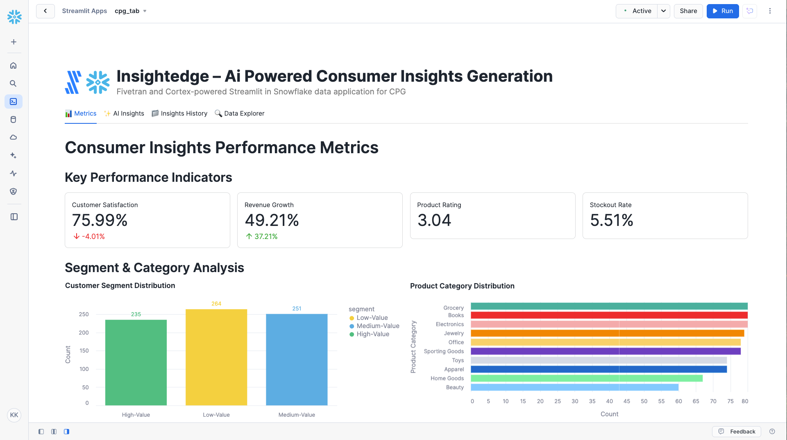

# InsightEdge – AI-powered Consumer Insights Generation

A Fivetran and Cortex-powered Streamlit in Snowflake data application for Consumer Packaged Goods (CPG).

## Overview

InsightEdge is an AI-powered consumer insights generation system that helps CPG companies transform large datasets into actionable insights. This Streamlit in Snowflake data application helps product development, marketing, and sales teams make informed decisions, identify emerging trends early, and improve customer satisfaction through real-time analysis of consumer data.

The application utilizes a synthetic consumer insights dataset that simulates data from major feedback platforms, market research sources, and social media. This synthetic data is moved into Snowflake using a custom connector built with the Fivetran Connector SDK, enabling reliable and efficient data pipelines for CPG analytics.

## Data Sources

The application is designed to work with data from major consumer insights platforms and databases:

### Consumer Insights Data Sources (Simulated)
- **Customer Feedback**: 
  - Medallia
  - Qualtrics
  - SurveyMonkey
- **Market Research**: 
  - Nielsen
  - Euromonitor
- **Social Media**: 
  - Twitter
  - Facebook
  - Instagram

For demonstration and development purposes, we've created a synthetic dataset that approximates these data sources and combined them into a single table exposed through an API server. This approach allows for realistic CPG analytics without using protected consumer information.

## Key Features

- **AI-powered consumer insights generation**: Leverages generative AI to analyze customer feedback, market research, and social media data to provide actionable insights
- **Integration with synthetic consumer data**: Simulates data from major feedback platforms, market research sources, and social media
- **Comprehensive data application**: Visual representation of key metrics including customer satisfaction, revenue growth, product ratings, and inventory metrics
- **AI-powered insights**: Generate in-depth analysis of overall performance, optimization opportunities, financial impact, and strategic recommendations
- **Custom Fivetran connector**: Utilizes a custom connector built with the Fivetran Connector SDK to reliably move data from the API server to Snowflake

## Streamlit Data App Sections

### 📊 Metrics
- **Key Performance Indicators**: Track customer satisfaction, revenue growth, product ratings, and stockout rates
- **Segment & Category Analysis**: Visualize customer segment distribution and product category breakdown
- **Price Optimization Analysis**: Review price optimization results and recommendations
- **Satisfaction vs Growth Quadrant Analysis**: Map products by satisfaction and growth rates
- **Inventory & Order Analysis**: Monitor inventory turnover, overstock rates, and order fulfillment

### ✨ AI Insights
Generate AI-powered insights with different focus areas:
- **Overall Performance**: Comprehensive analysis of the consumer insights generation system
- **Optimization Opportunities**: Areas where consumer insights can be improved
- **Financial Impact**: Cost-benefit analysis and ROI in CPG terms
- **Strategic Recommendations**: Long-term strategic implications for improvement

### 📁 Insights History
Access previously generated insights for reference and comparison.

### 🔍 Data Explorer
Explore the underlying data with pagination controls.

## Setup Instructions

1. Within Snowflake, click on **Projects**
2. Click on **Streamlit**
3. Click the blue box in the upper right to create a new Streamlit application
4. On the next page:
   - Name your application
   - **IMPORTANT:** Set the database context
   - **IMPORTANT:** Set the schema context

### Fivetran Data Movement Setup

1. Ensure the API server hosting the synthetic consumer insights data is operational
2. Configure the custom Fivetran connector (built with Fivetran Connector SDK) to connect to the API server - debug and deploy
3. Start the Fivetran sync in the Fivetran UI to move data into a `CPG_RECORDS` table in your Snowflake instance
4. Verify data is being loaded correctly by checking the table in Snowflake

## Data Flow

1. **Synthetic Data Creation**: A synthetic dataset approximating real consumer insights data sources has been created and exposed via an API server:
   - Customer Feedback: Medallia, Qualtrics, SurveyMonkey
   - Market Research: Nielsen, Euromonitor
   - Social Media: Twitter, Facebook, Instagram

2. **Custom Data Integration**: A custom connector built with the Fivetran Connector SDK communicates with the API server to extract the synthetic consumer insights data

3. **Automated Data Movement**: Fivetran manages the orchestration and scheduling of data movement from the API server into Snowflake

4. **Data Loading**: The synthetic consumer insights data is loaded into Snowflake as a `CPG_RECORDS` table in a structured format ready for analysis

5. **Data Analysis**: Snowpark for Python and Snowflake Cortex analyze the data to generate insights

6. **Data Visualization**: Streamlit in Snowflake presents the analyzed data in an interactive data application

## Data Requirements

The application expects a table named `CPG_RECORDS` which contains synthetic data simulating various consumer insights systems. This data is retrieved from an API server using a custom Fivetran connector built with the Fivetran Connector SDK:

### Consumer Feedback Data
- `customer_id`
- `feedback_text`
- `feedback_rating`
- `sentiment_score`

### Market Research Data
- `market_research_id`
- `market_trend`
- `product_category_trend`

### Social Media Data
- `social_media_id`
- `social_media_post`
- `sentiment_score_trend`

### Product Data
- `product_id`
- `product_name`
- `product_category`
- `product_rating`

### Insights Data
- `insight_type`
- `insight_description`
- `insight_accuracy`
- `recommended_action`
- `action_status`

### Customer Data
- `customer_segment`
- `customer_subsegment`
- `customer_satisfaction_rate`
- `customer_satisfaction_trend`
- `customer_retention_rate`

### Performance Metrics
- `revenue_growth_rate`
- `time_to_market`
- `return_on_investment`
- `stockout_rate`
- `inventory_turnover`
- `overstock_rate`
- `order_status`
- `price_optimization_result`
- `price_optimization_recommendation`

## Benefits

- 12% increase in product sales: $1,200,000 additional sales/year
- 10% reduction in product development costs: $500,000 savings/year
- 15% improvement in customer satisfaction: 12% increase in satisfied customers
- 10% reduction in marketing costs: $200,000 savings/year

## Technical Details

This application uses:
- Streamlit in Snowflake for the user interface
- Snowflake Cortex for AI-powered insights generation
- Multiple AI models including Llama 3.1/3.3, Mistral, Claude, and more
- Snowpark for Python for data processing
- **Fivetran Connector SDK** for building a custom connector to retrieve synthetic consumer insights data from an API server
- **Custom Fivetran connector** for automated, reliable data movement into Snowflake