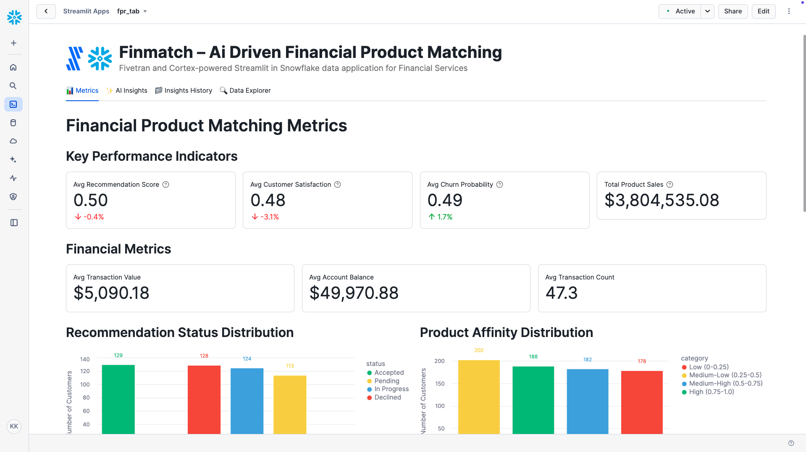

# FinMatch – AI-driven Financial Product Matching

A Fivetran and Cortex-powered Streamlit in Snowflake data application for Financial Services.

## Overview

FinMatch is an AI-driven financial product matching system that helps financial institutions provide personalized product recommendations to their customers. This Streamlit in Snowflake data application helps retail banking managers, product managers, and customer experience teams increase product sales, reduce customer churn, and improve customer satisfaction through real-time analysis of customer data.

The application utilizes a synthetic financial dataset that simulates data from major core banking systems, CRM platforms, and transaction logs. This synthetic data is moved into Snowflake using a custom connector built with the Fivetran Connector SDK, enabling reliable and efficient data pipelines for financial services analytics.

## Data Sources

The application is designed to work with data from major financial systems and platforms:

### Financial Data Sources (Simulated)
- **Core Banking Systems**: 
  - FIS
  - Fiserv
  - Temenos
- **Customer Relationship Management (CRM)**: 
  - Salesforce
  - HubSpot
  - Zoho
- **Customer Transaction Data**: 
  - Core banking systems
  - Transaction logs

For demonstration and development purposes, we've created a synthetic dataset that approximates these data sources and combined them into a single table exposed through an API server. This approach allows for realistic financial analytics without using protected customer information.

## Key Features

- **AI-powered product matching engine**: Leverages generative AI to analyze customer data and provide personalized financial product recommendations
- **Integration with synthetic banking data**: Simulates data from major core banking systems, CRM platforms, and transaction logs
- **Comprehensive data application**: Visual representation of key metrics including recommendation scores, customer satisfaction, and product sales
- **AI-powered insights**: Generate in-depth analysis of overall performance, optimization opportunities, financial impact, and strategic recommendations
- **Custom Fivetran connector**: Utilizes a custom connector built with the Fivetran Connector SDK to reliably move data from the API server to Snowflake

## Streamlit Data App Sections

### 📊 Metrics
- **Key Performance Indicators**: Track recommendation scores, customer satisfaction, churn probability, and product sales
- **Financial Metrics**: Monitor transaction values, account balances, and transaction counts
- **Recommendation Status Distribution**: Visualize the distribution of recommendation statuses (accepted, pending, in progress, declined)
- **Product Affinity Distribution**: See the breakdown of customer product affinity levels
- **Customer Lifecycle Stage Distribution**: Analyze customer distribution across lifecycle stages
- **Product Metrics**: Review top product types and customer segments

### ✨ AI Insights
Generate AI-powered insights with different focus areas:
- **Overall Performance**: Comprehensive analysis of the financial product matching system
- **Optimization Opportunities**: Areas where product matching can be improved
- **Financial Impact**: Cost-benefit analysis and ROI in retail banking terms
- **Strategic Recommendations**: Long-term strategic implications for improvement

### 📁 Insights History
Access previously generated insights for reference and comparison.

### 🔍 Data Explorer
Explore the underlying data with pagination controls.

## Setup Instructions

1. Within Snowflake, click on **Projects**
2. Click on **Streamlit**
3. Click the blue box in the upper right to create a new Streamlit application
4. On the next page:
   - Name your application
   - **IMPORTANT:** Set the database context
   - **IMPORTANT:** Set the schema context

### Fivetran Data Movement Setup

1. Ensure the API server hosting the synthetic financial data is operational
2. Configure the custom Fivetran connector (built with Fivetran Connector SDK) to connect to the API server - debug and deploy
3. Start the Fivetran sync in the Fivetran UI to move data into a `FPR_RECORDS` table in your Snowflake instance
4. Verify data is being loaded correctly by checking the table in Snowflake

## Data Flow

1. **Synthetic Data Creation**: A synthetic dataset approximating real financial data sources has been created and exposed via an API server:
   - Core Banking Systems: FIS, Fiserv, Temenos
   - Customer Relationship Management: Salesforce, HubSpot, Zoho
   - Customer Transaction Data: Core banking systems, transaction logs

2. **Custom Data Integration**: A custom connector built with the Fivetran Connector SDK communicates with the API server to extract the synthetic financial data

3. **Automated Data Movement**: Fivetran manages the orchestration and scheduling of data movement from the API server into Snowflake

4. **Data Loading**: The synthetic financial data is loaded into Snowflake as a `FPR_RECORDS` table in a structured format ready for analysis

5. **Data Analysis**: Snowpark for Python and Snowflake Cortex analyze the data to generate insights

6. **Data Visualization**: Streamlit in Snowflake presents the analyzed data in an interactive data application

## Data Requirements

The application expects a table named `FPR_RECORDS` which contains synthetic data simulating various financial systems. This data is retrieved from an API server using a custom Fivetran connector built with the Fivetran Connector SDK:

### Customer Data
- `customer_id`
- `customer_name`
- `customer_email`
- `customer_segment`
- `customer_lifecycle_stage`
- `customer_lifecycle_stage_transition_date`
- `account_balance`

### Transaction Data
- `transaction_history`
- `customer_transaction_value`
- `customer_transaction_count`

### Product Data
- `product_id`
- `product_name`
- `product_type`
- `product_terms`
- `product_sales_amount`
- `product_sales_date`

### Recommendation Data
- `product_recommendation`
- `product_recommendation_date`
- `product_recommendation_status`
- `recommendation_score`

### Customer Behavior Data
- `customer_product_usage`
- `customer_product_usage_trend`
- `customer_product_interests`
- `customer_product_affinity`
- `customer_product_affinity_trend`

### Performance Metrics
- `customer_satisfaction_score`
- `customer_churn_probability`

## Benefits

- 10% increase in product sales: $1,000,000 additional sales/year
- 15% reduction in customer churn: 300 fewer churned customers/year
- 20% increase in customer satisfaction: 2,000 additional satisfied customers/year
- 5% increase in average revenue per user (ARPU): $5,000,000 additional revenue/year

## Technical Details

This application uses:
- Streamlit in Snowflake for the user interface
- Snowflake Cortex for AI-powered insights generation
- Multiple AI models including Llama 3.1/3.3, Mistral, Claude, and more
- Snowpark for Python for data processing
- **Fivetran Connector SDK** for building a custom connector to retrieve synthetic financial data from an API server
- **Custom Fivetran connector** for automated, reliable data movement into Snowflake