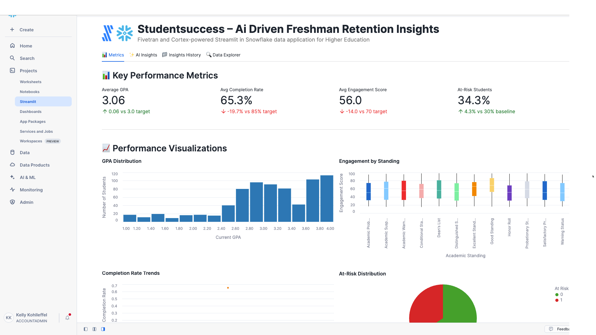

# StudentSuccess – AI-driven Freshman Retention Insights

A Fivetran and Cortex-powered Streamlit in Snowflake data application for Higher Education.

## Overview

StudentSuccess is an AI-driven freshman retention insights system that helps higher education institutions automate the complex process of identifying at-risk students and predicting retention outcomes. This Streamlit in Snowflake data application helps academic advisors, student success coordinators, and enrollment management teams improve freshman retention rates, protect tuition revenue, enable early intervention, and increase prediction accuracy through real-time analysis of student academic and engagement data.

The application utilizes a synthetic higher education dataset that simulates data from student information systems (SIS), learning management systems (LMS), and academic integrity platforms. This synthetic data is moved into Snowflake using a custom connector built with the Fivetran Connector SDK, enabling reliable and efficient data pipelines for higher education student success analytics.

## Data Sources

The application is designed to work with data from major higher education systems:

### Higher Education Data Sources (Simulated)
- **Student Information Systems (SIS)**: 
  - Banner
  - PeopleSoft
  - Colleague
- **Learning Management Systems (LMS)**: 
  - Canvas
  - Blackboard
  - Moodle
- **Academic Integrity Systems**: 
  - Turnitin
  - SafeAssign
- **Engagement Analytics Platforms**: 
  - BrightBytes
  - Civitas Learning

For demonstration and development purposes, we've created a synthetic dataset that approximates these data sources and combined them into a single table exposed through an API server. This approach allows for realistic higher education student success analytics without using proprietary student data.

## Key Features

- **AI-powered early warning system**: Leverages machine learning to identify at-risk students and predict retention outcomes with advanced algorithms
- **Integration with synthetic higher education data**: Simulates data from major SIS platforms, LMS systems, and academic integrity tools
- **Comprehensive data application**: Visual representation of key metrics including GPA trends, engagement scores, completion rates, and retention risk indicators
- **AI-powered insights**: Generate in-depth analysis of overall performance, optimization opportunities, financial impact, and strategic recommendations
- **Custom Fivetran connector**: Utilizes a custom connector built with the Fivetran Connector SDK to reliably move data from the API server to Snowflake

## Streamlit Data App Sections

### 📊 Metrics
- **Key Performance Indicators**: Track average GPA, completion rates, engagement scores, and at-risk student percentages
- **Academic Analytics**: Monitor student performance across majors, academic standings, and advisor assignments
- **GPA Distribution**: Visualize the distribution of current GPA across the student population
- **Engagement Analysis**: Analyze engagement scores by academic standing with boxplot visualizations
- **Completion Rate Trends**: Track course completion rates over time to identify patterns
- **At-Risk Distribution**: Review at-risk vs. not at-risk student distribution across the institution
- **Aid vs GPA Correlation**: Map relationships between financial aid amounts and academic performance
- **Major Performance**: Monitor average GPA by major to identify high and low-performing academic programs

### ✨ AI Insights
Generate AI-powered insights with different focus areas:
- **Overall Performance**: Comprehensive analysis of the freshman retention prediction system
- **Optimization Opportunities**: Areas where student success interventions and retention efforts can be improved
- **Financial Impact**: Cost-benefit analysis and ROI in higher education terms
- **Strategic Recommendations**: Long-term strategic implications for digital transformation in student success

### 📁 Insights History
Access previously generated insights for reference and comparison.

### 🔍 Data Explorer
Explore the underlying student data with pagination controls.

## Setup Instructions

1. Within Snowflake, click on **Projects**
2. Click on **Streamlit**
3. Click the blue box in the upper right to create a new Streamlit application
4. On the next page:
   - Name your application
   - **IMPORTANT:** Set the database context
   - **IMPORTANT:** Set the schema context

### Fivetran Data Movement Setup

1. Ensure the API server hosting the synthetic higher education data is operational
2. Configure the custom Fivetran connector (built with Fivetran Connector SDK) to connect to the API server - debug and deploy
3. Start the Fivetran sync in the Fivetran UI to move data into a `HED_RECORDS` table in your Snowflake instance
4. Verify data is being loaded correctly by checking the table in Snowflake

## Data Flow

1. **Synthetic Data Creation**: A synthetic dataset approximating real higher education data sources has been created and exposed via an API server:
   - Student Information Systems: Banner, PeopleSoft, Colleague
   - Learning Management Systems: Canvas, Blackboard, Moodle
   - Academic Integrity Systems: Turnitin, SafeAssign
   - Engagement Analytics: BrightBytes, Civitas Learning

2. **Custom Data Integration**: A custom connector built with the Fivetran Connector SDK communicates with the API server to extract the synthetic higher education student data

3. **Automated Data Movement**: Fivetran manages the orchestration and scheduling of data movement from the API server into Snowflake

4. **Data Loading**: The synthetic higher education data is loaded into Snowflake as a `HED_RECORDS` table in a structured format ready for analysis

5. **Data Analysis**: Snowpark for Python and Snowflake Cortex analyze the data to generate insights

6. **Data Visualization**: Streamlit in Snowflake presents the analyzed data in an interactive data application

## Data Requirements

The application expects a table named `HED_RECORDS` which contains synthetic data simulating various higher education systems. This data is retrieved from an API server using a custom Fivetran connector built with the Fivetran Connector SDK:

### Student Academic Data
- `record_id`
- `student_id`
- `enrollment_date`
- `academic_standing`
- `current_gpa`
- `credit_hours_attempted`
- `credit_hours_earned`
- `major_code`
- `advisor_id`
- `financial_aid_amount`

### Engagement and Performance Metrics
- `last_login_date`
- `total_course_views`
- `assignment_submissions`
- `discussion_posts`
- `avg_assignment_score`
- `course_completion_rate`
- `plagiarism_incidents`
- `writing_quality_score`
- `engagement_score`
- `at_risk_flag`
- `intervention_count`
- `last_updated`

## Benefits

- **15% improvement in freshman retention rate**: 1,000 freshman students × 85% baseline retention × 15% improvement = 127 additional retained students/year
- **$2,500,000 in tuition revenue protection annually**: 127 additional retained students × $20,000 average tuition = $2,540,000 revenue protection/year
- **40% reduction in time to identify at-risk students**: Traditional 8-week identification → 5-week identification = 3-week earlier intervention
- **90% accuracy in at-risk student prediction**: Improved from 65% manual identification accuracy to 90% AI-powered accuracy

## Technical Details

This application uses:
- Streamlit in Snowflake for the user interface
- Snowflake Cortex for AI-powered insights generation
- Multiple AI models including Claude 4 Sonnet, Claude 3.5 Sonnet, Llama 3.1/3.3, Mistral, DeepSeek, and more
- Snowpark for Python for data processing
- **Fivetran Connector SDK** for building a custom connector to retrieve synthetic higher education data from an API server
- **Custom Fivetran connector** for automated, reliable data movement into Snowflake

## Success Metrics

- Freshman retention rate improvement
- Early identification accuracy
- Intervention effectiveness
- Time to risk identification
- Revenue protection through retention

## Key Stakeholders

- Academic Advisors
- Student Success Coordinators
- Enrollment Management Teams
- C-level Executive: Provost and Vice President of Student Affairs

## Competitive Advantage

StudentSuccess differentiates itself by leveraging advanced machine learning algorithms to predict student retention risk using a comprehensive dataset that includes academic performance, engagement metrics, financial aid status, and behavioral indicators. This holistic approach enables earlier and more accurate identification of at-risk students compared to traditional reactive advising methods.

## Long-term Evolution

Over the next 3-5 years, StudentSuccess will expand to include predictive analytics for course success, degree completion forecasting, and personalized learning pathway recommendations. Integration with emerging technologies like natural language processing for sentiment analysis and IoT campus engagement tracking will further enhance prediction accuracy and support comprehensive student success initiatives.