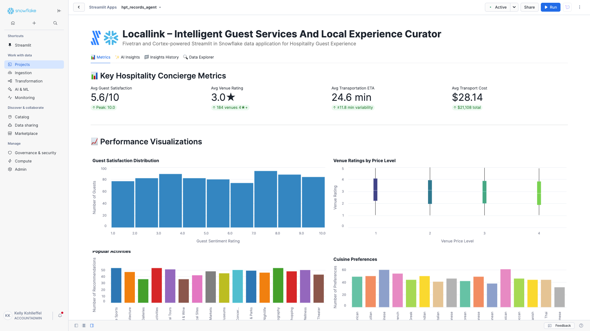

# LocalLink – Intelligent Guest Services and Local Experience Curator

A Fivetran and Cortex-powered Streamlit in Snowflake data application for intelligent hospitality guest services and local experience curation.

## Overview

LocalLink is an intelligent guest services and local experience curator system that helps hotels provide comprehensive local expertise and personalized recommendations at scale, transforming generic tourist suggestions into memorable experiences that drive guest satisfaction and loyalty. This Streamlit in Snowflake data application helps Guest Services Managers, Concierge Staff, and Guest Relations Directors improve recommendation accuracy, optimize local partnerships, and enhance guest experiences through real-time analysis of guest preferences, local venue data, and booking patterns.

The application utilizes a comprehensive hospitality dataset that consolidates data from guest preference systems, local event APIs, and venue information platforms. This data is moved into Snowflake using Fivetran connectors, enabling reliable and efficient data pipelines for AI-driven guest service analytics and intelligent local experience curation strategies.

## Data Sources

The application is designed to work with data from major hospitality and local experience management systems:

### Guest Preference Data Sources
- **Guest Preference Systems**: 
  - Revinate
  - TrustYou
  - Medallia
- **Local Event APIs**: 
  - Eventbrite
  - Facebook Events
  - Meetup API
- **Restaurant and Attraction Data**: 
  - Yelp Fusion API
  - Google Places API
  - TripAdvisor Content API
- **Transportation Services**: 
  - Uber API
  - Lyft API
  - Local transit feeds
- **Weather Services**: 
  - OpenWeatherMap
  - AccuWeather
  - Weather Underground

The application consolidates these disparate data sources into a unified `HPT_RECORDS` table that provides a comprehensive view of guest preferences, local venue quality, real-time availability, and booking information for personalized concierge recommendation analytics.

## Key Features

- **AI-powered personalized recommendations**: Leverages generative AI models to analyze guest preferences and create unique, contextual local experiences
- **Integration with comprehensive hospitality data**: Consolidates data from guest preference systems, local event APIs, and venue information platforms
- **Comprehensive guest experience analytics**: Visual representation of key metrics including guest satisfaction scores, venue ratings, activity preferences, and local partnership performance
- **AI-powered insights**: Generate in-depth analysis of overall performance, optimization opportunities, financial impact, and strategic recommendations
- **Fivetran integration**: Utilizes Fivetran connectors to reliably move data from multiple hospitality and local experience systems to Snowflake

## Streamlit Data App Sections

### 📊 Metrics
- **Key Performance Indicators**: Track average guest satisfaction (sentiment rating), venue quality (rating), transportation efficiency (ETA minutes), and local partnership revenue
- **Guest Experience Analytics**: Monitor cuisine preferences, activity type distribution, and weather impact on recommendations
- **Guest Satisfaction Distribution**: Visualize guest sentiment ratings across the customer base to identify satisfaction trends
- **Venue Ratings by Price Level**: Analyze venue quality across different price points to optimize recommendation strategies
- **Popular Activity Preferences**: Track activity type preferences to understand guest behavior patterns
- **Preferred Cuisine Types**: Monitor dining preferences to improve restaurant recommendations
- **Weather Impact on Guest Preferences**: Correlation analysis between weather conditions and guest preference scores
- **Transportation Efficiency Analysis**: Compare ETA and cost estimates across different activity types and venues
- **Event Availability Status**: Modern radial visualization showing real-time event availability and booking status
- **Guest Preferences vs Venue Quality**: Correlation analysis between guest preference scores and venue ratings

### ✨ AI Insights
Generate AI-powered insights with different focus areas:
- **Overall Performance**: Comprehensive analysis of the guest concierge system using guest preferences, venue recommendations, event bookings, and local experience data
- **Optimization Opportunities**: Areas where guest recommendation accuracy, local experience curation, and concierge service efficiency can be improved
- **Financial Impact**: Cost-benefit analysis and ROI in guest experience terms (operational costs vs. guest satisfaction and revenue benefits)
- **Strategic Recommendations**: Long-term strategic implications for digital transformation in hospitality guest experience and local partnership management

### 📁 Insights History
Access previously generated insights for reference and comparison across different time periods and focus areas.

### 🔍 Data Explorer
Explore the underlying hospitality data with pagination controls to examine individual guest preferences and concierge recommendation metrics.

## Setup Instructions

1. Within Snowflake, click on **Projects**
2. Click on **Streamlit**
3. Click the blue box in the upper right to create a new Streamlit application
4. On the next page:
   - Name your application: `locallink_intelligent_guest_services_and_local_experience_curator`
   - **IMPORTANT:** Set the database context
   - **IMPORTANT:** Set the schema context

### Fivetran Data Movement Setup

1. Configure Fivetran connectors for your hospitality data sources:
   - **Guest Preference Connectors**: Connect to Revinate, TrustYou, and Medallia systems for guest satisfaction and preference data
   - **Local Event API Connectors**: Set up connectors for Eventbrite, Facebook Events, and Meetup API for real-time event information
   - **Venue Data Connectors**: Configure connectors for Yelp Fusion API, Google Places API, and TripAdvisor Content API for restaurant and attraction data
   - **Transportation API Connectors**: Set up connectors for Uber API, Lyft API, and local transit feeds for transportation recommendations
   - **Weather API Connectors**: Configure connectors for OpenWeatherMap, AccuWeather, and Weather Underground for weather-based activity suggestions
2. Start the Fivetran syncs in the Fivetran UI to move data into a `HPT_RECORDS` table in your Snowflake instance
3. Verify data is being loaded correctly by checking the table structure and sample records in Snowflake

## Data Flow

1. **Hospitality Data Collection**: Real-time guest and local experience data is collected from multiple sources:
   - **Guest Systems**: Revinate, TrustYou, Medallia for guest preference and satisfaction data
   - **Local APIs**: Eventbrite, Facebook Events, Meetup API for real-time event and activity information
   - **Venue Platforms**: Yelp, Google Places, TripAdvisor for restaurant and attraction ratings and details
   - **Transportation Services**: Uber, Lyft, and transit APIs for transportation options and estimates
   - **Weather Services**: Multiple weather APIs for conditions affecting activity recommendations

2. **Automated Data Integration**: Fivetran connectors manage the orchestration and scheduling of data movement from various hospitality systems into Snowflake

3. **Data Consolidation**: Hospitality data is consolidated into Snowflake as a unified `HPT_RECORDS` table combining guest preferences, venue information, event availability, and booking data

4. **AI-Powered Analysis**: Snowpark for Python and Snowflake Cortex analyze the consolidated hospitality data to generate personalized recommendations and guest experience insights

5. **Interactive Visualization**: Streamlit in Snowflake presents the analyzed data in an interactive application for guest services teams and concierge staff

## Data Requirements

The application expects a table named `HPT_RECORDS` which contains consolidated hospitality data combining guest preferences, local venue data, real-time availability, and booking information for AI-powered concierge recommendations:

### Guest and Record Identifiers
- `RECORD_ID`
- `GUEST_ID`
- `RECOMMENDATION_TIMESTAMP`

### Guest Preference Data
- `GUEST_PREFERENCE_SCORE`
- `GUEST_SENTIMENT_RATING`
- `PREFERRED_CUISINE_TYPES`
- `ACTIVITY_PREFERENCES`

### Event Information
- `EVENT_ID`
- `EVENT_NAME`
- `EVENT_CATEGORY`
- `EVENT_START_DATETIME`
- `EVENT_AVAILABILITY_STATUS`

### Venue Details
- `VENUE_ID`
- `VENUE_NAME`
- `VENUE_RATING`
- `VENUE_PRICE_LEVEL`
- `VENUE_LATITUDE`
- `VENUE_LONGITUDE`

### Transportation and Weather Data
- `TRANSPORTATION_ETA_MINUTES`
- `TRANSPORTATION_COST_ESTIMATE`
- `WEATHER_CONDITION`
- `TEMPERATURE_FAHRENHEIT`

## Benefits

- **$315,000 in additional commission revenue annually**: $2,100,000 annual guest spending × 15% increase = $315,000 additional revenue/year
- **1,095 additional positive guest reviews annually**: 7,300 annual guests × 15% baseline review rate × 10% improvement = 1,095 additional reviews/year
- **2,190 fewer concierge service requests annually**: 21,900 annual requests × 10% reduction through self-service = 2,190 fewer requests/year
- **438 additional repeat bookings annually**: 4,380 annual guests × 10% baseline repeat rate × 10% improvement = 438 additional bookings/year

## Technical Details

This application uses:
- Streamlit in Snowflake for the user interface
- Snowflake Cortex for AI-powered insights generation with multiple models:
  - Claude 4 Sonnet, Claude 3.5 Sonnet
  - OpenAI GPT models (GPT-4.1, GPT-5 series)
  - Llama 3.1/3.3 (8B, 70B, 405B variants)
  - Mistral Large2, DeepSeek R1, Snowflake Arctic
- Snowpark for Python for data processing and analytics
- **Fivetran connectors** for automated, reliable data movement from guest preference systems, local event APIs, and venue platforms into Snowflake
- **Altair** for interactive data visualizations with enhanced title positioning and padding for Snowflake environments

## Success Metrics

- Guest engagement with recommendations measured through interaction rates and booking conversions
- Local experience booking conversion rates across different venue types and activity categories
- Guest satisfaction scores for concierge services tracked through sentiment analysis and review ratings
- Revenue from local partnership commissions generated through successful recommendations
- Reduction in manual concierge requests through AI-powered self-service capabilities

## Key Stakeholders

- **Primary**: Guest Services Managers, Concierge Staff, Guest Relations Directors
- **Secondary**: General Managers, Marketing Directors, Local Partnership Coordinators
- **Tertiary**: Data Scientists, IT Operations, Hotel Operations Teams
- **Top C-Level Executive**: Chief Experience Officer (CXO) and Chief Marketing Officer (CMO)

## Competitive Advantage

LocalLink differentiates from traditional approaches by leveraging generative AI to create unique, contextual local experiences by synthesizing real-time availability, guest preferences, weather conditions, and local insights to craft personalized itineraries. Unlike static concierge services or generic recommendation engines, the system uses Natural Language Processing models to understand guest inquiries and preferences while generative AI creates personalized recommendations and detailed itineraries that feel natural and helpful while incorporating real-time local data.

The technical approach employs a combination of NLP, machine learning, and real-time data processing to analyze guest preferences and local conditions, implementing advanced pattern recognition to match guests with optimal experiences, and generating conversational responses that create memorable and personalized local experiences.

## Risk Assessment

**Potential Implementation Challenges**: Local vendor relationship management requires dedicated partnership coordination, data accuracy maintained through continuous validation and updates, guest privacy protected through secure data handling protocols

**Mitigation Strategies**: Established partnership coordination protocols with local venues and service providers, automated data validation and real-time update systems for venue and event information, comprehensive privacy protection measures and secure data handling procedures, phased implementation approach starting with pilot properties, close collaboration with guest services teams and concierge staff

## Long-term Evolution

**Near-term (6-12 months)**: Integration with mobile guest apps for seamless recommendation delivery, expansion of local vendor partnerships for broader experience options, enhanced multi-language support for international guests

**Medium-term (1-2 years)**: Integration with augmented reality for location-based experience guidance, development of predictive preference modeling based on guest history, expansion to include group travel and event planning capabilities

**Long-term (3-5 years)**: LocalLink will evolve to incorporate advanced generative AI techniques, such as real-time personalization engines, to adapt to changing guest preferences and local market conditions. Evolution toward fully autonomous concierge services with proactive recommendation delivery, integration with emerging hospitality technologies, expansion to cross-property guest experience continuity and loyalty program integration.