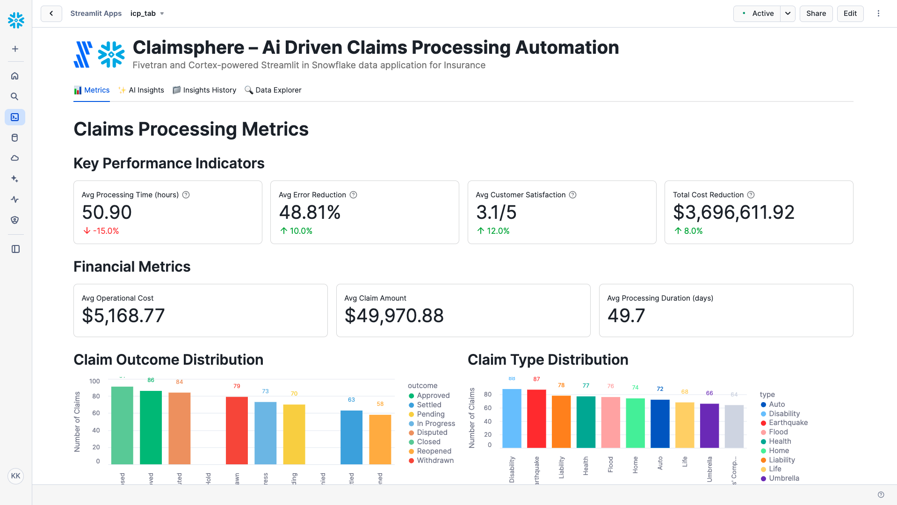

# ClaimSphere – AI-driven Claims Processing Automation

A Fivetran and Cortex-powered Streamlit in Snowflake data application for Insurance.

## Overview

ClaimSphere is an AI-driven claims processing automation system that helps insurance companies transform manual claims handling into a streamlined, efficient process. This Streamlit in Snowflake data application helps claims managers, underwriters, and customer service representatives reduce processing time, minimize errors, and improve customer satisfaction through real-time analysis of claims data.

The application utilizes a synthetic insurance dataset that simulates data from major claims management systems, policy administration systems, and CRM platforms. This synthetic data is moved into Snowflake using a custom connector built with the Fivetran Connector SDK, enabling reliable and efficient data pipelines for insurance analytics.

## Data Sources

The application is designed to work with data from major insurance systems and platforms:

### Insurance Data Sources (Simulated)
- **Claims Management Systems**: 
  - Guidewire
  - Duck Creek
  - Insurity
- **Policy Administration Systems**: 
  - Oracle
  - SAP
  - Insurity
- **Customer Relationship Management (CRM)**: 
  - Salesforce
  - HubSpot
  - Zoho

For demonstration and development purposes, we've created a synthetic dataset that approximates these data sources and combined them into a single table exposed through an API server. This approach allows for realistic insurance analytics without using protected policyholder information.

## Key Features

- **Automated claims data extraction and validation**: Leverages AI to extract and validate claims data from various sources
- **AI-driven claims classification and routing**: Automatically categorizes and routes claims to the appropriate processing teams
- **Predictive analytics for claims outcome forecasting**: Predicts claim outcomes based on historical data patterns
- **Integration with synthetic insurance data**: Simulates data from major claims management systems, policy administration systems, and CRM platforms
- **Comprehensive data application**: Visual representation of key metrics including processing times, error reduction, and customer satisfaction
- **AI-powered insights**: Generate in-depth analysis of overall performance, optimization opportunities, financial impact, and strategic recommendations
- **Custom Fivetran connector**: Utilizes a custom connector built with the Fivetran Connector SDK to reliably move data from the API server to Snowflake

## Streamlit Data App Sections

### 📊 Metrics
- **Key Performance Indicators**: Track processing times, error reduction rates, customer satisfaction ratings, and cost reduction
- **Financial Metrics**: Monitor operational costs, claim amounts, and processing durations
- **Claim Outcome Distribution**: Visualize the distribution of claim outcomes (approved, settled, pending, etc.)
- **Claim Type Distribution**: Analyze the breakdown of claim types
- **Customer Satisfaction Ratings**: Review customer satisfaction metrics on a 1-5 scale
- **Claims Processing Metrics**: Explore top claim categories, subcategories, and customer segments

### ✨ AI Insights
Generate AI-powered insights with different focus areas:
- **Overall Performance**: Comprehensive analysis of the claims processing automation system
- **Optimization Opportunities**: Areas where claims processing can be improved
- **Financial Impact**: Cost-benefit analysis and ROI in insurance terms
- **Strategic Recommendations**: Long-term strategic implications for improvement

### 📁 Insights History
Access previously generated insights for reference and comparison.

### 🔍 Data Explorer
Explore the underlying data with pagination controls.

## Setup Instructions

1. Within Snowflake, click on **Projects**
2. Click on **Streamlit**
3. Click the blue box in the upper right to create a new Streamlit application
4. On the next page:
   - Name your application
   - **IMPORTANT:** Set the database context
   - **IMPORTANT:** Set the schema context

### Fivetran Data Movement Setup

1. Ensure the API server hosting the synthetic insurance data is operational
2. Configure the custom Fivetran connector (built with Fivetran Connector SDK) to connect to the API server - debug and deploy
3. Start the Fivetran sync in the Fivetran UI to move data into an `ICP_RECORDS` table in your Snowflake instance
4. Verify data is being loaded correctly by checking the table in Snowflake

## Data Flow

1. **Synthetic Data Creation**: A synthetic dataset approximating real insurance data sources has been created and exposed via an API server:
   - Claims Management Systems: Guidewire, Duck Creek, Insurity
   - Policy Administration Systems: Oracle, SAP, Insurity
   - Customer Relationship Management (CRM): Salesforce, HubSpot, Zoho

2. **Custom Data Integration**: A custom connector built with the Fivetran Connector SDK communicates with the API server to extract the synthetic insurance data

3. **Automated Data Movement**: Fivetran manages the orchestration and scheduling of data movement from the API server into Snowflake

4. **Data Loading**: The synthetic insurance data is loaded into Snowflake as an `ICP_RECORDS` table in a structured format ready for analysis

5. **Data Analysis**: Snowpark for Python and Snowflake Cortex analyze the data to generate insights

6. **Data Visualization**: Streamlit in Snowflake presents the analyzed data in an interactive data application

## Data Requirements

The application expects a table named `ICP_RECORDS` which contains synthetic data simulating various insurance systems. This data is retrieved from an API server using a custom Fivetran connector built with the Fivetran Connector SDK:

### Policy and Claim Data
- `policy_id`
- `claim_id`
- `claim_date`
- `claim_status`
- `claim_type`
- `claim_outcome`
- `claim_category`
- `claim_subcategory`
- `policy_effective_date`
- `claim_amount`

### Customer Data
- `customer_id`
- `customer_name`
- `customer_segment`

### Processing Metrics
- `claim_processing_time`
- `claim_processing_duration`
- `claim_processing_start_date`
- `claim_processing_end_date`
- `claim_processing_error_reduction`

### Performance Metrics
- `customer_satisfaction_rating`
- `operational_cost`
- `operational_cost_reduction`

## Benefits

- 15% reduction in claims processing time: 15,000 hours saved/year
- 10% reduction in claims processing errors: 500 fewer errors/year
- 12% increase in customer satisfaction ratings: 960 additional satisfied customers/year
- 8% reduction in operational costs: $800,000 savings/year

## Technical Details

This application uses:
- Streamlit in Snowflake for the user interface
- Snowflake Cortex for AI-powered insights generation
- Multiple AI models including Llama 3.1/3.3, Mistral, Claude, and more
- Snowpark for Python for data processing
- **Fivetran Connector SDK** for building a custom connector to retrieve synthetic insurance data from an API server
- **Custom Fivetran connector** for automated, reliable data movement into Snowflake