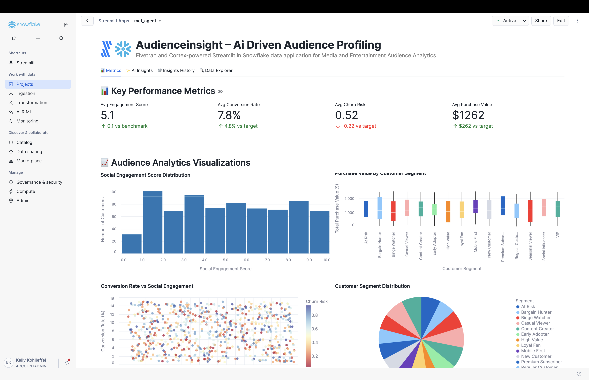

# AudienceInsight – AI-driven Audience Profiling

A Fivetran and Cortex-powered Streamlit in Snowflake data application for Media and Entertainment Audience Analytics with advanced AI Agent Workflows.

## Overview

AudienceInsight is an AI-powered audience profiling and targeting system that helps media and entertainment companies automate the manual and time-consuming process of analyzing customer engagement data, social media analytics, and audience behavior patterns. This Streamlit in Snowflake data application helps Chief Marketing Officers, Marketing Directors, and Content Creators increase sales through targeted marketing, improve customer satisfaction, reduce marketing costs, and accelerate audience engagement through real-time analysis of comprehensive audience profiling data.

The application features sophisticated AI Agent Workflows that provide transparent, step-by-step analysis of audience data, transforming complex customer demographics and engagement metrics into actionable content insights and personalized marketing recommendations. Each analysis focus area operates through specialized mini-agents that simulate the decision-making process of experienced marketing professionals and audience analytics experts.

The application utilizes a synthetic media and entertainment dataset that simulates data from social media APIs, customer relationship management systems, and digital analytics platforms. This synthetic data is moved into Snowflake using a custom connector built with the Fivetran Connector SDK, enabling reliable and efficient data pipelines for comprehensive audience analytics.

## AI Agent Workflows

### Agent Architecture Overview

AudienceInsight employs a sophisticated multi-agent architecture designed specifically for media and entertainment audience profiling analysis. Each focus area operates through specialized AI agents that break down complex audience targeting and content strategy tasks into transparent, sequential steps that mirror the thought processes of experienced marketing professionals and audience analytics experts.

### Focus Area Agents

#### Overall Performance Agent
**Business Challenge**: Chief Marketing Officers manually review hundreds of audience engagement metrics, customer segment reports, and content performance data daily, spending 4+ hours analyzing audience behavior patterns, social media engagement effectiveness, and customer journey optimization to identify critical engagement issues and content strategy opportunities.

**Agent Solution**: Autonomous audience analytics workflow that analyzes customer engagement data, social media metrics, purchase behaviors, and content preferences to generate automated audience summaries, identify engagement bottlenecks, and produce prioritized audience insights with personalized content recommendations.

**Agent Workflow Steps**:
1. **Audience Analytics Data Initialization** - Loading comprehensive audience profiling dataset with enhanced validation across customer records and audience segments
2. **Customer Engagement Assessment** - Advanced calculation of audience indicators with engagement analysis
3. **Audience Pattern Recognition** - Sophisticated identification of customer behavior patterns with demographic correlation analysis
4. **AI Audience Intelligence Processing** - Processing comprehensive audience data through selected AI model with advanced reasoning
5. **Audience Performance Report Compilation** - Professional audience analytics with evidence-based recommendations and actionable content strategy insights

#### Optimization Opportunities Agent
**Business Challenge**: Marketing Directors spend 5+ hours daily manually identifying inefficiencies in audience targeting strategies, content personalization approaches, and customer engagement campaigns across multiple social media platforms and digital marketing channels.

**Agent Solution**: AI-powered audience optimization analysis that automatically detects customer engagement gaps, content performance inefficiencies, and targeting improvements with specific implementation recommendations for CRM and marketing automation system integration.

**Agent Workflow Steps**:
1. **Audience Optimization Data Preparation** - Advanced loading of customer engagement data with enhanced validation for targeting improvement identification
2. **Customer Engagement Inefficiency Detection** - Sophisticated analysis of targeting strategies and content performance with evidence-based inefficiency identification
3. **Audience Analytics Correlation Analysis** - Enhanced examination of relationships between customer segments, demographics, and engagement success rates
4. **CRM Integration Optimization** - Comprehensive evaluation of marketing operations integration with existing Salesforce, HubSpot, and analytics systems
5. **AI Audience Intelligence** - Generating advanced audience optimization recommendations using selected AI model with marketing reasoning
6. **Audience Strategy Finalization** - Professional audience optimization report with prioritized implementation roadmap and engagement impact analysis

#### Financial Impact Agent
**Business Challenge**: VP of Marketing manually calculate complex ROI metrics across audience engagement activities and customer acquisition performance, requiring 4+ hours of cost modeling to assess marketing efficiency and customer lifetime value optimization across the customer portfolio.

**Agent Solution**: Automated marketing financial analysis that calculates comprehensive audience engagement ROI, identifies customer acquisition cost reduction opportunities across demographic segments, and projects engagement efficiency benefits with detailed marketing cost forecasting.

**Agent Workflow Steps**:
1. **Marketing Financial Data Integration** - Advanced loading of audience analytics financial data and marketing cost metrics with enhanced validation across customer records
2. **Marketing ROI Cost-Benefit Calculation** - Sophisticated ROI metrics calculation with customer acquisition analysis and audience engagement efficiency cost savings
3. **Customer Lifetime Value Impact Assessment** - Enhanced analysis of audience engagement revenue impact with customer retention metrics and acquisition cost correlation analysis
4. **Marketing Resource Efficiency Analysis** - Comprehensive evaluation of resource allocation efficiency across customer acquisition activities with campaign lifecycle cost optimization
5. **AI Marketing Financial Modeling** - Advanced audience analytics financial projections and marketing ROI calculations using selected AI model
6. **Marketing Economics Report Generation** - Professional marketing financial impact analysis with detailed audience engagement ROI calculations and customer acquisition cost forecasting

#### Strategic Recommendations Agent
**Business Challenge**: Chief Marketing Officers spend hours manually analyzing digital transformation opportunities and developing strategic audience intelligence roadmaps for personalized content advancement and AI-driven engagement implementation across customer touchpoints.

**Agent Solution**: Strategic audience intelligence workflow that analyzes competitive advantages against traditional demographic-based marketing approaches, identifies AI and personalization integration opportunities, and creates prioritized digital marketing transformation roadmaps.

**Agent Workflow Steps**:
1. **Marketing Technology Assessment** - Advanced loading of audience analytics digital context with competitive positioning analysis across customer records and audience segments
2. **Audience Competitive Advantage Analysis** - Sophisticated evaluation of competitive positioning against traditional demographic marketing with AI-powered audience optimization effectiveness
3. **Advanced Marketing Technology Integration** - Enhanced analysis of integration opportunities with personalized content, dynamic pricing, and AI-powered customer segmentation across audience data dimensions
4. **Digital Marketing Strategy Development** - Comprehensive development of prioritized digital transformation roadmap with evidence-based marketing technology adoption strategies
5. **AI Marketing Strategic Processing** - Advanced audience analytics strategic recommendations using selected AI model with long-term competitive positioning
6. **Digital Marketing Report Generation** - Professional digital marketing transformation roadmap with competitive analysis and audience technology implementation plan ready for CMO executive review

### Agent Execution Flow

1. **Agent Initialization** - User selects focus area and AI model, triggering specialized agent activation
2. **Data Context Loading** - Agent accesses customer engagement data, social media metrics, and purchase behavior records
3. **Step-by-Step Processing** - Agent executes sequential workflow steps with real-time progress visualization
4. **Audience Intelligence Integration** - Selected Snowflake Cortex model processes marketing context with specialized prompting
5. **Results Compilation** - Agent generates comprehensive audience analysis with actionable content recommendations
6. **Report Delivery** - Professional marketing report delivered with implementation roadmap and success metrics

## Data Sources

The application is designed to work with data from major media and entertainment audience analytics systems:

### Media and Entertainment Data Sources (Simulated)
- **Social Media APIs**: 
  - Twitter API
  - Facebook Graph API
  - Instagram API
  - TikTok Business API
- **Customer Relationship Management (CRM) Systems**: 
  - Salesforce
  - HubSpot
  - Zoho CRM
- **Digital Analytics Platforms**: 
  - Google Analytics
  - Adobe Analytics
  - Mixpanel
  - Amplitude
- **Content Management Systems**:
  - WordPress
  - Drupal
  - Adobe Experience Manager
- **E-commerce Platforms**:
  - Shopify
  - WooCommerce
  - Magento
- **Marketing Automation**:
  - Marketo
  - Pardot
  - Mailchimp
- **Customer Data Platforms**:
  - Segment
  - Tealium
  - Adobe Real-time CDP

For demonstration and development purposes, we've created a synthetic dataset that approximates these data sources and combined them into a single table exposed through an API server. This approach allows for realistic media and entertainment audience analytics without using proprietary customer data.

## Key Features

- **AI Agent Workflows**: Transparent, step-by-step audience analysis through specialized mini-agents for each focus area
- **Agent Progress Visualization**: Real-time display of agent processing steps with marketing context and completion tracking
- **Focus Area Specialization**: Dedicated agents for Overall Performance, Optimization Opportunities, Financial Impact, and Strategic Recommendations
- **Audience Intelligence Integration**: Seamless integration with multiple Snowflake Cortex models for specialized marketing analysis
- **AI-powered audience profiling optimization**: Leverages generative AI to analyze customer engagement patterns and automatically generate optimized targeting strategies with key insights
- **Integration with synthetic media data**: Simulates data from major social media platforms, CRM systems, and digital analytics tools
- **Comprehensive data application**: Visual representation of key metrics including engagement scores, conversion rates, customer demographics, and content performance
- **Custom Fivetran connector**: Utilizes a custom connector built with the Fivetran Connector SDK to reliably move data from the API server to Snowflake

## Streamlit Data App Sections

### Metrics
- **Key Performance Indicators**: Track social engagement scores, conversion rates, churn risk, and purchase values
- **Audience Analytics**: Monitor customer segments, engagement trends, and content performance efficiency
- **Social Engagement Distribution**: Visualize audience engagement scores across customer base
- **Purchase Value Analysis**: Analyze purchase values by customer segment with boxplot visualizations
- **Conversion vs Engagement**: Track correlation between social engagement and conversion rates
- **Customer Segment Distribution**: Review segment distribution across audience demographics
- **Age Demographics**: Map purchase behavior by age range demographics
- **Website Performance**: Monitor session metrics to identify high-performing content

### AI Insights with Agent Workflows
Generate AI-powered insights through transparent agent workflows with different focus areas:
- **Overall Performance**: Comprehensive analysis of the audience profiling and targeting system through autonomous audience analytics workflow
- **Optimization Opportunities**: Areas where customer engagement and content personalization can be improved via AI-powered audience optimization analysis
- **Financial Impact**: Cost-benefit analysis and ROI in marketing development terms through automated marketing financial analysis
- **Strategic Recommendations**: Long-term strategic implications for digital transformation via strategic audience intelligence workflow

Each focus area includes:
- **Business Challenge Description**: Detailed explanation of the specific marketing problem being addressed
- **Agent Solution Overview**: Description of how the AI agent workflow solves the audience challenge
- **Real-time Progress Tracking**: Step-by-step visualization of agent processing with marketing context
- **Agent Execution Controls**: Start/stop controls for managing agent workflow execution
- **Professional Marketing Reports**: Comprehensive analysis reports with implementation roadmaps

### Insights History
Access previously generated agent-driven insights for reference and comparison, including agent execution details and model selection.

### Data Explorer
Explore the underlying audience profiling data with pagination controls.

## Setup Instructions

1. Within Snowflake, click on **Projects**
2. Click on **Streamlit**
3. Click the blue box in the upper right to create a new Streamlit application
4. On the next page:
   - Name your application
   - **IMPORTANT:** Set the database context
   - **IMPORTANT:** Set the schema context

### Fivetran Data Movement Setup

1. Ensure the API server hosting the synthetic media and entertainment data is operational
2. Configure the custom Fivetran connector (built with Fivetran Connector SDK) to connect to the API server - debug and deploy
3. Start the Fivetran sync in the Fivetran UI to move data into a `MET_RECORDS` table in your Snowflake instance
4. Verify data is being loaded correctly by checking the table in Snowflake

## Data Flow

1. **Synthetic Data Creation**: A synthetic dataset approximating real media and entertainment audience data sources has been created and exposed via an API server:
   - Social Media APIs: Twitter API, Facebook Graph API, Instagram API
   - Customer Relationship Management Systems: Salesforce, HubSpot, Zoho
   - Digital Analytics Platforms: Google Analytics, Adobe Analytics, Mixpanel

2. **Custom Data Integration**: A custom connector built with the Fivetran Connector SDK communicates with the API server to extract the synthetic media and entertainment audience data

3. **Automated Data Movement**: Fivetran manages the orchestration and scheduling of data movement from the API server into Snowflake

4. **Data Loading**: The synthetic media data is loaded into Snowflake as a `MET_RECORDS` table in a structured format ready for analysis

5. **Agent Workflow Execution**: AI agents process the audience data through specialized workflows, providing transparent step-by-step analysis

6. **Data Analysis**: Snowpark for Python and Snowflake Cortex analyze the data to generate insights through agent-driven processes

7. **Data Visualization**: Streamlit in Snowflake presents the analyzed data in an interactive data application with agent workflow visualization

## Data Requirements

The application expects a table named `MET_RECORDS` which contains synthetic data simulating various media and entertainment audience analytics systems. This data is retrieved from an API server using a custom Fivetran connector built with the Fivetran Connector SDK:

### Customer Profile Data
- `record_id`
- `customer_id`
- `record_timestamp`
- `first_name`
- `last_name`
- `email_address`
- `age_range`
- `gender`
- `location_city`
- `location_country`

### Engagement Metrics
- `social_media_followers`
- `social_engagement_score`
- `content_preferences`
- `website_sessions`
- `avg_session_duration`
- `conversion_rate`
- `lead_score`
- `engagement_trend`

### Purchase Behavior
- `last_purchase_date`
- `total_purchase_value`
- `purchase_frequency`
- `customer_segment`
- `predicted_churn_risk`
- `recommended_content_type`

## Benefits

- **2,400 additional conversions per month**: 20,000 monthly visitors × 12% baseline conversion rate × 12% increase = 2,400 additional conversions/month
- **4,000 additional satisfied customers monthly**: 10,000 monthly customers × 40% baseline satisfaction rate × 20% improvement = 4,000 additional satisfied customers/month
- **$75,000 annual marketing cost savings**: $500,000 annual marketing costs × 15% reduction = $75,000 savings/year
- **9,000 additional monthly engagements**: 50,000 monthly viewers × 20% baseline engagement rate × 18% increase = 9,000 additional engagements/month
- **Enhanced Marketing Transparency**: Agent workflows provide clear visibility into audience analysis reasoning and decision-making processes
- **Accelerated Content Insights**: Automated agent processing reduces manual analysis time from hours to minutes for complex audience assessments

## Technical Details

This application uses:
- **AI Agent Workflow Engine**: Custom agent orchestration system for transparent, step-by-step audience analysis
- **Multi-Agent Architecture**: Specialized agents for different marketing focus areas with domain-specific processing
- **Agent Progress Visualization**: Real-time display of agent execution steps with audience analytics context and completion tracking
- **Streamlit in Snowflake** for the user interface with enhanced agent workflow displays
- **Snowflake Cortex** for AI-powered insights generation through agent-managed prompting
- **Multiple AI models** including OpenAI GPT, Claude 4 Sonnet, Claude 3.5 Sonnet, Llama 3.1/3.3, Mistral, DeepSeek, and more for agent intelligence
- **Snowpark for Python** for data processing within agent workflows
- **Fivetran Connector SDK** for building a custom connector to retrieve synthetic media and entertainment audience data from an API server
- **Custom Fivetran connector** for automated, reliable data movement into Snowflake

## Success Metrics

- Sales conversions
- Customer satisfaction scores
- Marketing costs
- Audience engagement rates
- **Agent Workflow Efficiency**: Time reduction from manual audience analysis to automated agent-driven insights
- **Marketing Transparency Score**: User confidence in content recommendations through visible agent reasoning
- **Audience Targeting Accuracy**: Improvement in engagement rates through systematic agent processing

## Key Stakeholders

- Chief Marketing Officer (CMO)
- VP of Marketing
- Marketing Directors
- Content Creators
- Marketing Teams
- Sales Teams
- Digital Marketing Specialists
- Customer Experience Managers
- Social Media Managers
- **Marketing Analysts**: Professionals who benefit from transparent agent workflow visibility
- **Content Strategy Teams**: Staff who implement agent-recommended audience targeting strategies

## Competitive Advantage

AudienceInsight differentiates itself by leveraging generative AI with transparent agent workflows to automate the audience profiling process, reducing manual labor and increasing the speed of insights. The agent-based architecture provides unprecedented visibility into audience analysis reasoning, building trust and confidence in AI-driven marketing decisions. This creates a competitive advantage by enabling faster decision-making and improved targeting efficiency in media and entertainment marketing while maintaining complete transparency in the analysis process.

## Long-term Evolution

In the next 3-5 years, AudienceInsight will evolve to incorporate more advanced generative AI techniques and sophisticated agent architectures, including:

- **Multi-modal Agent Learning**: Agents that can process customer images, video content, and social media posts from diverse digital platforms
- **Collaborative Agent Networks**: Multiple agents working together to solve complex audience targeting challenges across different content categories
- **Adaptive Agent Intelligence**: Self-improving agents that learn from campaign outcomes and refine their analytical approaches
- **Advanced Agent Orchestration**: Sophisticated workflow management for complex, multi-step audience analysis processes
- **Integration with Emerging Marketing Technologies**: Agent connectivity with influencer platforms, podcast analytics, and streaming service data for comprehensive audience intelligence

The system will expand to include integration with emerging technologies like real-time personalization engines and predictive content recommendation systems, all orchestrated through advanced agent workflows that provide complete transparency and control over the audience analysis process.