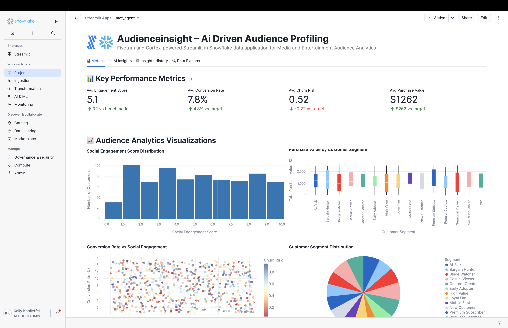

# AudienceInsight – AI-Driven Audience Profiling

A Fivetran and Cortex-powered Streamlit in Snowflake data application for Media and Entertainment Audience Analytics with advanced AI Agent Workflows.

## Overview

AudienceInsight is an AI-driven audience profiling system that helps media and entertainment companies automate the manual and time-consuming process of analyzing audience demographics, content preferences, and engagement behaviors. This Streamlit in Snowflake data application helps Chief Marketing Officers, content creators, and marketing teams increase sales through targeted marketing, improve customer satisfaction, optimize marketing costs, and enhance audience engagement through real-time analysis of consolidated audience profiling data.

The application features sophisticated AI Agent Workflows that provide transparent, step-by-step analysis of audience profiling data, transforming complex customer segmentation models and content optimization strategies into actionable marketing insights and adaptive audience targeting recommendations. Each analysis focus area operates through specialized mini-agents that simulate the decision-making process of experienced marketing professionals and audience insight experts.

The application utilizes a synthetic media and entertainment dataset that simulates data from social media engagement platforms, CRM customer systems, and digital analytics tools. This synthetic data is moved into Snowflake using a custom connector built with the Fivetran Connector SDK, enabling reliable and efficient data pipelines for media and entertainment audience analytics.

## AI Agent Workflows

### Agent Architecture Overview

AudienceInsight employs a sophisticated multi-agent architecture designed specifically for media and entertainment audience profiling analysis. Each focus area operates through specialized AI agents that break down complex audience segmentation and content optimization tasks into transparent, sequential steps that mirror the thought processes of experienced marketing professionals and audience insight specialists.

### Focus Area Agents

#### Overall Performance Agent
**Business Challenge**: Chief Marketing Officers and VP of Marketing manually review hundreds of audience profiles, engagement metrics, and content performance data daily, spending 4+ hours analyzing social engagement scores, conversion rates, and customer segments to identify critical marketing inefficiencies and audience targeting optimization opportunities.

**Agent Solution**: Autonomous audience profiling workflow that analyzes customer data, engagement metrics, content performance, and social media intelligence to generate automated audience summaries, identify marketing bottlenecks, and produce prioritized audience insights with adaptive content strategy recommendations.

**Agent Workflow Steps**:
1. **Audience Profiling Data Initialization** - Loading comprehensive audience dataset with enhanced validation across customer records and engagement metrics
2. **Engagement Performance Assessment** - Advanced calculation of audience profiling indicators with social engagement analysis
3. **Customer Segmentation Pattern Recognition** - Sophisticated identification of audience patterns with content preference correlation analysis
4. **AI Audience Intelligence Processing** - Processing comprehensive audience data through selected AI model with advanced reasoning
5. **Marketing Performance Report Compilation** - Professional audience analysis with evidence-based recommendations and actionable marketing insights

#### Optimization Opportunities Agent
**Business Challenge**: Marketing Teams spend 5+ hours daily manually identifying inefficiencies in audience targeting strategies, content personalization criteria, and customer journey optimization across multiple demographic segments and content categories.

**Agent Solution**: AI-powered audience optimization analysis that automatically detects engagement gaps, content personalization inefficiencies, and customer retention improvements with specific implementation recommendations for Salesforce, HubSpot, and Google Analytics integration.

**Agent Workflow Steps**:
1. **Audience Optimization Data Preparation** - Advanced loading of audience profiling data with enhanced validation for engagement improvement identification
2. **Customer Engagement Inefficiency Detection** - Sophisticated analysis of audience targeting strategies and content performance with evidence-based inefficiency identification
3. **Marketing Correlation Analysis** - Enhanced examination of relationships between customer segments, content preferences, and engagement rates
4. **CRM Integration Optimization** - Comprehensive evaluation of audience profiling integration with existing Salesforce, HubSpot, and analytics systems
5. **AI Marketing Intelligence** - Generating advanced audience optimization recommendations using selected AI model with marketing reasoning
6. **Content Strategy Finalization** - Professional audience optimization report with prioritized implementation roadmap and engagement impact analysis

#### Financial Impact Agent
**Business Challenge**: Chief Marketing Officers manually calculate complex ROI metrics across audience targeting activities and content marketing performance, requiring 4+ hours of cost modeling to assess marketing efficiency and customer acquisition costs across the audience portfolio.

**Agent Solution**: Automated marketing financial analysis that calculates comprehensive audience profiling ROI, identifies marketing cost reduction opportunities across customer segments, and projects engagement improvement benefits with detailed marketing cost forecasting.

**Agent Workflow Steps**:
1. **Marketing Financial Data Integration** - Advanced loading of audience profiling financial data and marketing cost metrics with enhanced validation across customer records
2. **Audience Targeting Cost-Benefit Calculation** - Sophisticated ROI metrics calculation with customer acquisition analysis and marketing efficiency cost savings
3. **Customer Lifetime Value Impact Assessment** - Enhanced analysis of marketing revenue impact with customer retention metrics and engagement correlation analysis
4. **Marketing Resource Efficiency Analysis** - Comprehensive evaluation of resource allocation efficiency across audience targeting activities with customer lifecycle cost optimization
5. **AI Marketing Financial Modeling** - Advanced audience profiling financial projections and marketing ROI calculations using selected AI model
6. **Marketing Economics Report Generation** - Professional marketing financial impact analysis with detailed audience profiling ROI calculations and customer acquisition cost forecasting

#### Strategic Recommendations Agent
**Business Challenge**: Chief Marketing Officers spend hours manually analyzing digital transformation opportunities and developing strategic audience targeting technology roadmaps for personalization advancement and adaptive marketing implementation across customer portfolios.

**Agent Solution**: Strategic audience intelligence workflow that analyzes competitive advantages against traditional demographic targeting processes, identifies AI and personalized content integration opportunities, and creates prioritized digital marketing transformation roadmaps.

**Agent Workflow Steps**:
1. **Marketing Technology Assessment** - Advanced loading of audience profiling digital context with competitive positioning analysis across customer records and engagement metrics
2. **Audience Targeting Competitive Advantage Analysis** - Sophisticated evaluation of competitive positioning against traditional demographic targeting with AI-powered personalization effectiveness
3. **Advanced Marketing Technology Integration** - Enhanced analysis of integration opportunities with social media APIs, real-time analytics, and AI-powered content recommendation across audience data dimensions
4. **Digital Marketing Strategy Development** - Comprehensive development of prioritized digital transformation roadmap with evidence-based marketing technology adoption strategies
5. **AI Marketing Strategic Processing** - Advanced audience profiling strategic recommendations using selected AI model with long-term competitive positioning
6. **Digital Content Strategy Report Generation** - Professional digital marketing transformation roadmap with competitive analysis and audience targeting technology implementation plan ready for CMO executive review

### Agent Execution Flow

1. **Agent Initialization** - User selects focus area and AI model, triggering specialized agent activation
2. **Data Context Loading** - Agent accesses customer profiles, engagement metrics, and content performance data
3. **Step-by-Step Processing** - Agent executes sequential workflow steps with real-time progress visualization
4. **Marketing Intelligence Integration** - Selected Snowflake Cortex model processes audience profiling context with specialized prompting
5. **Results Compilation** - Agent generates comprehensive audience analysis with actionable marketing recommendations
6. **Report Delivery** - Professional marketing report delivered with implementation roadmap and success metrics

## Data Sources

The application is designed to work with data from major media and entertainment audience platforms:

### Media and Entertainment Data Sources (Simulated)
- **Social Media APIs**: 
  - Twitter API
  - Facebook Graph API
  - Instagram API
- **Customer Relationship Management (CRM) Systems**: 
  - Salesforce
  - HubSpot
  - Zoho
- **Digital Analytics Platforms**: 
  - Google Analytics
  - Adobe Analytics
  - Mixpanel
- **Content Management Systems**:
  - WordPress
  - Drupal
  - Adobe Experience Manager
- **Marketing Automation**:
  - Marketo
  - Pardot
  - Mailchimp
- **Streaming and Media Platforms**:
  - Netflix Analytics
  - YouTube Analytics
  - Spotify for Artists
  - Disney+ Analytics

For demonstration and development purposes, we've created a synthetic dataset that approximates these data sources and combined them into a single table exposed through an API server. This approach allows for realistic media and entertainment audience analytics without using proprietary customer data.

## Key Features

- **AI Agent Workflows**: Transparent, step-by-step audience profiling analysis through specialized mini-agents for each focus area
- **Agent Progress Visualization**: Real-time display of agent processing steps with marketing context and completion tracking
- **Focus Area Specialization**: Dedicated agents for Overall Performance, Optimization Opportunities, Financial Impact, and Strategic Recommendations
- **Marketing Intelligence Integration**: Seamless integration with multiple Snowflake Cortex models for specialized audience profiling analysis
- **AI-powered audience profiling optimization**: Leverages generative AI to analyze customer demographics and behaviors to automatically generate optimized audience profiles with key insights
- **Integration with synthetic media and entertainment data**: Simulates data from major social media platforms, CRM systems, and digital analytics tools
- **Comprehensive data application**: Visual representation of key metrics including social engagement scores, conversion rates, customer segments, and purchase behaviors
- **Custom Fivetran connector**: Utilizes a custom connector built with the Fivetran Connector SDK to reliably move data from the API server to Snowflake

## Streamlit Data App Sections

### Metrics
- **Key Performance Indicators**: Track social engagement scores, conversion rates, churn risk, and average purchase values
- **Audience Analytics**: Monitor customer segment distributions, content preferences, and engagement trends
- **Demographics Analysis**: Visualize age range and gender distributions across audience segments
- **Engagement Analysis**: Analyze social engagement scores by customer segment with detailed visualizations
- **Purchase Behavior**: Track purchase values and frequency over time by demographics
- **Conversion Tracking**: Review conversion rates across different audience segments
- **Churn Prevention**: Monitor predicted churn risk by customer demographics to identify at-risk segments
- **Content Performance**: Analyze top-performing content types by engagement rates and customer preferences

### AI Insights with Agent Workflows
Generate AI-powered insights through transparent agent workflows with different focus areas:
- **Overall Performance**: Comprehensive analysis of the audience profiling and customer engagement system through autonomous audience profiling workflow
- **Optimization Opportunities**: Areas where audience targeting and content personalization can be improved via AI-powered audience optimization analysis
- **Financial Impact**: Cost-benefit analysis and ROI in marketing terms through automated marketing financial analysis
- **Strategic Recommendations**: Long-term strategic implications for digital transformation via strategic audience intelligence workflow

Each focus area includes:
- **Business Challenge Description**: Detailed explanation of the specific marketing problem being addressed
- **Agent Solution Overview**: Description of how the AI agent workflow solves the audience profiling challenge
- **Real-time Progress Tracking**: Step-by-step visualization of agent processing with marketing context
- **Agent Execution Controls**: Start/stop controls for managing agent workflow execution
- **Professional Marketing Reports**: Comprehensive analysis reports with implementation roadmaps

### Insights History
Access previously generated agent-driven insights for reference and comparison, including agent execution details and model selection.

### Data Explorer
Explore the underlying audience profiling data with pagination controls.

## Setup Instructions

1. Within Snowflake, click on **Projects**
2. Click on **Streamlit**
3. Click the blue box in the upper right to create a new Streamlit application
4. On the next page:
   - Name your application
   - **IMPORTANT:** Set the database context
   - **IMPORTANT:** Set the schema context

### Fivetran Data Movement Setup

1. Ensure the API server hosting the synthetic media and entertainment audience data is operational
2. Configure the custom Fivetran connector (built with Fivetran Connector SDK) to connect to the API server - debug and deploy
3. Start the Fivetran sync in the Fivetran UI to move data into a `MET_RECORDS` table in your Snowflake instance
4. Verify data is being loaded correctly by checking the table in Snowflake

## Data Flow

1. **Synthetic Data Creation**: A synthetic dataset approximating real media and entertainment audience data sources has been created and exposed via an API server:
   - Social Media APIs: Twitter API, Facebook Graph API, Instagram API
   - Customer Relationship Management Systems: Salesforce, HubSpot, Zoho
   - Digital Analytics Platforms: Google Analytics, Adobe Analytics, Mixpanel

2. **Custom Data Integration**: A custom connector built with the Fivetran Connector SDK communicates with the API server to extract the synthetic media and entertainment audience data

3. **Automated Data Movement**: Fivetran manages the orchestration and scheduling of data movement from the API server into Snowflake

4. **Data Loading**: The synthetic audience data is loaded into Snowflake as a `MET_RECORDS` table in a structured format ready for analysis

5. **Agent Workflow Execution**: AI agents process the audience profiling data through specialized workflows, providing transparent step-by-step analysis

6. **Data Analysis**: Snowpark for Python and Snowflake Cortex analyze the data to generate insights through agent-driven processes

7. **Data Visualization**: Streamlit in Snowflake presents the analyzed data in an interactive data application with agent workflow visualization

## Data Requirements

The application expects a table named `MET_RECORDS` which contains synthetic data simulating various media and entertainment audience systems. This data is retrieved from an API server using a custom Fivetran connector built with the Fivetran Connector SDK:

### Customer Identifiers
- `RECORD_ID`
- `CUSTOMER_ID`
- `RECORD_TIMESTAMP`

### Personal Information
- `FIRST_NAME`
- `LAST_NAME`
- `EMAIL_ADDRESS`

### Demographics
- `AGE_RANGE`
- `GENDER`
- `LOCATION_CITY`
- `LOCATION_COUNTRY`

### Social Media Metrics
- `SOCIAL_MEDIA_FOLLOWERS` (Integer)
- `SOCIAL_ENGAGEMENT_SCORE` (Float)
- `CONTENT_PREFERENCES`

### Purchase Behavior
- `LAST_PURCHASE_DATE`
- `TOTAL_PURCHASE_VALUE` (Float)
- `PURCHASE_FREQUENCY` (Integer)

### Digital Analytics
- `WEBSITE_SESSIONS` (Integer)
- `AVG_SESSION_DURATION` (Float)
- `CONVERSION_RATE` (Float)
- `LEAD_SCORE` (Integer)

### Audience Insights
- `CUSTOMER_SEGMENT`
- `PREDICTED_CHURN_RISK` (Float)
- `RECOMMENDED_CONTENT_TYPE`
- `ENGAGEMENT_TREND`

## Benefits

- **12% increase in sales through targeted marketing**: 20,000 monthly visitors × 12% baseline conversion rate × 12% increase = 2,400 additional conversions/month
- **20% improvement in customer satisfaction**: 10,000 monthly customers × 40% baseline satisfaction rate × 20% improvement = 4,000 additional satisfied customers/month
- **15% reduction in marketing costs**: $500,000 annual marketing costs × 15% reduction = $75,000 savings/year
- **18% increase in audience engagement**: 50,000 monthly viewers × 20% baseline engagement rate × 18% increase = 9,000 additional engagements/month
- **Enhanced Marketing Transparency**: Agent workflows provide clear visibility into audience profiling analysis reasoning and decision-making processes
- **Accelerated Marketing Insights**: Automated agent processing reduces manual analysis time from hours to minutes for complex audience assessments

## Technical Details

This application uses:
- **AI Agent Workflow Engine**: Custom agent orchestration system for transparent, step-by-step audience profiling analysis
- **Multi-Agent Architecture**: Specialized agents for different marketing focus areas with domain-specific processing
- **Agent Progress Visualization**: Real-time display of agent execution steps with marketing context and completion tracking
- **Streamlit in Snowflake** for the user interface with enhanced agent workflow displays
- **Snowflake Cortex** for AI-powered insights generation through agent-managed prompting
- **Multiple AI models** including Claude 4 Sonnet, Claude 3.5 Sonnet, Llama 3.1/3.3, Mistral, DeepSeek, and more for agent intelligence
- **Snowpark for Python** for data processing within agent workflows
- **Fivetran Connector SDK** for building a custom connector to retrieve synthetic media and entertainment audience data from an API server
- **Custom Fivetran connector** for automated, reliable data movement into Snowflake

## Success Metrics

- Sales conversion improvements
- Customer satisfaction score increases
- Marketing cost reduction achievements
- Audience engagement rate improvements
- Customer lifetime value optimization
- Churn rate reduction
- **Agent Workflow Efficiency**: Time reduction from manual audience analysis to automated agent-driven insights
- **Marketing Transparency Score**: User confidence in audience recommendations through visible agent reasoning
- **Audience Targeting Accuracy**: Improvement in campaign success rates through systematic agent processing

## Key Stakeholders

- Chief Marketing Officer (CMO)
- VP of Marketing
- Content Creators
- Marketing Teams
- Sales Teams
- Customer Success Managers
- Digital Marketing Specialists
- Social Media Managers
- Data Analysts
- **Marketing Operations Analysts**: Professionals who benefit from transparent agent workflow visibility
- **Content Strategy Teams**: Staff who implement agent-recommended audience targeting strategies

## Competitive Advantage

AudienceInsight differentiates itself by leveraging generative AI with transparent agent workflows to automate the audience profiling process, reducing manual labor and increasing the speed of insights. The agent-based architecture provides unprecedented visibility into marketing analysis reasoning, building trust and confidence in AI-driven audience targeting decisions. This creates a competitive advantage by enabling faster decision-making and improved personalization in marketing operations while maintaining complete transparency in the analysis process.

## Risk Assessment

Potential challenges include data quality issues from multiple social media and CRM sources, algorithm bias in audience segmentation, and the need for continuous model updates as audience preferences evolve. Mitigation strategies include implementing robust data validation processes across all integrated platforms, regularly auditing the AI models for demographic and behavioral bias, and establishing automated feedback loops for real-time model improvement based on engagement performance.

## Long-term Evolution

In the next 3-5 years, AudienceInsight will evolve to incorporate more advanced generative AI techniques and sophisticated agent architectures, including:

- **Multi-modal Agent Learning**: Agents that can process social media content, customer feedback, and engagement data from diverse marketing systems
- **Collaborative Agent Networks**: Multiple agents working together to solve complex audience profiling challenges across different customer segments
- **Adaptive Agent Intelligence**: Self-improving agents that learn from campaign outcomes and refine their analytical approaches
- **Advanced Agent Orchestration**: Sophisticated workflow management for complex, multi-step audience analysis processes
- **Integration with Emerging Marketing Technologies**: Agent connectivity with AR/VR platforms, live streaming analytics, and autonomous content recommendation systems for comprehensive audience intelligence

The system will expand to include integration with emerging technologies like real-time personalization engines and multimodal content analysis, all orchestrated through advanced agent workflows that provide complete transparency and control over the audience profiling analysis process.