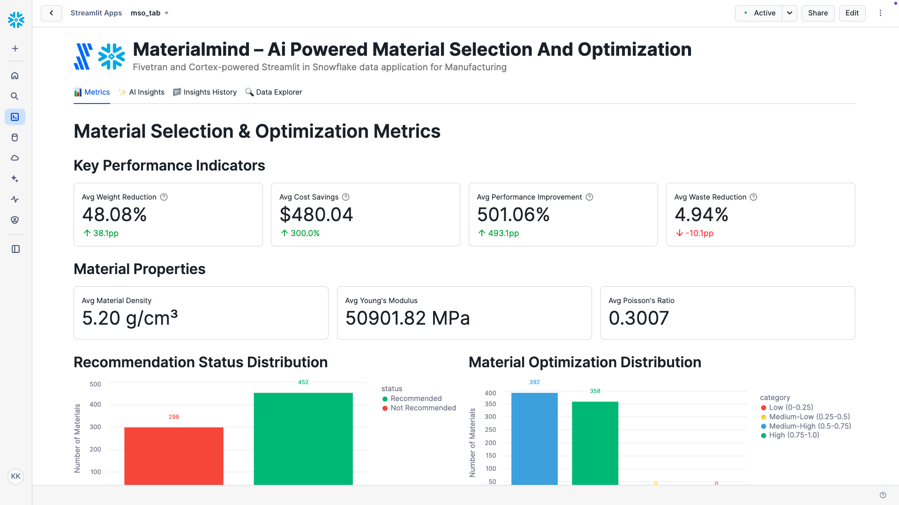

# MaterialMind – AI-powered Material Selection and Optimization

A Fivetran and Cortex-powered Streamlit in Snowflake data application for Manufacturing.

## Overview

MaterialMind is an AI-driven material selection and optimization system that helps manufacturers make better material choices for their products. This Streamlit in Snowflake data application helps product designers, materials engineers, and operations directors reduce material costs, decrease product weight, increase product performance, and reduce material waste through real-time analysis of material properties.

The application utilizes a synthetic manufacturing dataset that simulates data from material properties databases, product lifecycle management systems, and CAD systems. This synthetic data is moved into Snowflake using a custom connector built with the Fivetran Connector SDK, enabling reliable and efficient data pipelines for manufacturing analytics.

## Data Sources

The application is designed to work with data from major manufacturing systems and databases:

### Manufacturing Data Sources (Simulated)
- **Material Properties Databases**: 
  - MatWeb
  - Granta Design
  - Material Properties Database
- **Product Lifecycle Management (PLM) Systems**: 
  - Siemens Teamcenter
  - PTC Windchill
  - Oracle Agile
- **Computer-Aided Design (CAD) Systems**: 
  - Autodesk Inventor
  - SolidWorks
  - Siemens NX

For demonstration and development purposes, we've created a synthetic dataset that approximates these data sources and combined them into a single table exposed through an API server. This approach allows for realistic manufacturing analytics without using proprietary material data.

## Key Features

- **AI-driven material selection and optimization**: Leverages generative AI to analyze material properties and recommend optimal materials for specific product requirements
- **Integration with synthetic manufacturing data**: Simulates data from major material databases, PLM systems, and CAD platforms
- **Comprehensive data application**: Visual representation of key metrics including weight reduction, cost savings, performance improvement, and waste reduction
- **AI-powered insights**: Generate in-depth analysis of overall performance, optimization opportunities, financial impact, and strategic recommendations
- **Custom Fivetran connector**: Utilizes a custom connector built with the Fivetran Connector SDK to reliably move data from the API server to Snowflake

## Streamlit Data App Sections

### 📊 Metrics
- **Key Performance Indicators**: Track weight reduction, cost savings, performance improvement, and waste reduction
- **Material Properties**: Monitor density, Young's modulus, and Poisson's ratio
- **Recommendation Status Distribution**: Visualize the distribution of material selection recommendations
- **Material Optimization Distribution**: See the breakdown of optimization scores
- **Product Lifecycle Stage Distribution**: Analyze product distribution across lifecycle stages
- **Designer Metrics**: Review designer skill levels and CAD system usage
- **Cost Savings vs Weight Reduction Quadrant Analysis**: Map materials by cost savings and weight reduction performance

### ✨ AI Insights
Generate AI-powered insights with different focus areas:
- **Overall Performance**: Comprehensive analysis of the material selection and optimization system
- **Optimization Opportunities**: Areas where material selection can be improved
- **Financial Impact**: Cost-benefit analysis and ROI in manufacturing terms
- **Strategic Recommendations**: Long-term strategic implications for improvement

### 📁 Insights History
Access previously generated insights for reference and comparison.

### 🔍 Data Explorer
Explore the underlying data with pagination controls.

## Setup Instructions

1. Within Snowflake, click on **Projects**
2. Click on **Streamlit**
3. Click the blue box in the upper right to create a new Streamlit application
4. On the next page:
   - Name your application
   - **IMPORTANT:** Set the database context
   - **IMPORTANT:** Set the schema context

### Fivetran Data Movement Setup

1. Ensure the API server hosting the synthetic manufacturing data is operational
2. Configure the custom Fivetran connector (built with Fivetran Connector SDK) to connect to the API server - debug and deploy
3. Start the Fivetran sync in the Fivetran UI to move data into an `MSO_RECORDS` table in your Snowflake instance
4. Verify data is being loaded correctly by checking the table in Snowflake

## Data Flow

1. **Synthetic Data Creation**: A synthetic dataset approximating real manufacturing data sources has been created and exposed via an API server:
   - Material Properties Databases: MatWeb, Granta Design, Material Properties Database
   - Product Lifecycle Management Systems: Siemens Teamcenter, PTC Windchill, Oracle Agile
   - Computer-Aided Design Systems: Autodesk Inventor, SolidWorks, Siemens NX

2. **Custom Data Integration**: A custom connector built with the Fivetran Connector SDK communicates with the API server to extract the synthetic manufacturing data

3. **Automated Data Movement**: Fivetran manages the orchestration and scheduling of data movement from the API server into Snowflake

4. **Data Loading**: The synthetic manufacturing data is loaded into Snowflake as an `MSO_RECORDS` table in a structured format ready for analysis

5. **Data Analysis**: Snowpark for Python and Snowflake Cortex analyze the data to generate insights

6. **Data Visualization**: Streamlit in Snowflake presents the analyzed data in an interactive data application

## Data Requirements

The application expects a table named `MSO_RECORDS` which contains synthetic data simulating various manufacturing systems. This data is retrieved from an API server using a custom Fivetran connector built with the Fivetran Connector SDK:

### Material Data
- `material_id`
- `material_name`
- `density`
- `youngs_modulus`
- `poissons_ratio`
- `material_cost`
- `material_weight`
- `material_waste`
- `material_selection_score`
- `material_optimization_score`
- `material_selection_recommendation`
- `material_optimization_recommendation`
- `material_selection_date`
- `material_optimization_date`

### Product Data
- `product_id`
- `product_name`
- `product_description`
- `product_performance`
- `product_lifecycle_stage`
- `product_lifecycle_status`

### Designer Data
- `designer_id`
- `designer_name`
- `designer_experience`
- `designer_skill_level`
- `cad_system`
- `cad_file_name`

### Performance Metrics
- `cost_savings`
- `weight_reduction`
- `performance_improvement`
- `waste_reduction`

## Benefits

- 12% reduction in material costs: $120,000 savings/year
- 10% decrease in product weight: 10 kg/unit saved
- 8% increase in product performance: 8 additional units/year
- 15% reduction in material waste: 1,500 kg saved/year

## Technical Details

This application uses:
- Streamlit in Snowflake for the user interface
- Snowflake Cortex for AI-powered insights generation
- Multiple AI models including Llama 3.1/3.3, Mistral, Claude, and more
- Snowpark for Python for data processing
- **Fivetran Connector SDK** for building a custom connector to retrieve synthetic manufacturing data from an API server
- **Custom Fivetran connector** for automated, reliable data movement into Snowflake