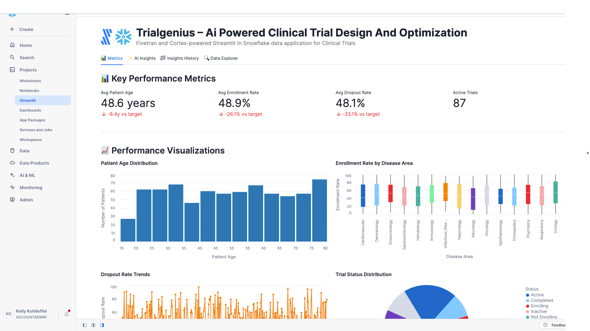

# TrialGenius – AI-Powered Clinical Trial Design and Optimization

A Fivetran and Cortex-powered Streamlit in Snowflake data application for Pharmaceutical Clinical Trials.

## Overview

TrialGenius is an AI-powered clinical trial design and optimization system that helps pharmaceutical companies automate the complex and time-consuming process of designing optimal clinical trials. This Streamlit in Snowflake data application helps Chief Medical Officers, clinical operations directors, and biostatisticians reduce trial failure risk, decrease development costs, optimize patient enrollment timelines, and minimize protocol amendments through real-time analysis of clinical trial management data.

The application utilizes a synthetic pharmaceutical dataset that simulates data from clinical trial management systems (CTMS), electronic data capture (EDC) systems, and real-world evidence databases. This synthetic data is moved into Snowflake using a custom connector built with the Fivetran Connector SDK, enabling reliable and efficient data pipelines for pharmaceutical clinical trial analytics.

## Data Sources

The application is designed to work with data from major pharmaceutical clinical trial systems:

### Pharmaceutical Data Sources (Simulated)
- **Clinical Trial Management Systems (CTMS)**: 
  - Veeva Vault CTMS
  - Oracle Clinical One
  - Medidata Rave
- **Electronic Data Capture (EDC) Systems**: 
  - Medidata Rave EDC
  - Oracle Clinical One Data Collection
  - Veeva Vault EDC
- **Real-World Evidence Databases**: 
  - Flatiron Health
  - IQVIA Real-World Data
  - Optum Clinformatics
- **Regulatory and Patient Registry Systems**: 
  - FDA Orange Book
  - ClinicalTrials.gov
  - TriNetX
  - IBM Watson Health

For demonstration and development purposes, we've created a synthetic dataset that approximates these data sources and combined them into a single table exposed through an API server. This approach allows for realistic pharmaceutical clinical trial analytics without using proprietary clinical trial data.

## Key Features

- **AI-powered clinical trial design optimization**: Leverages generative AI to analyze clinical trial protocols and automatically generate optimized trial designs with key insights
- **Integration with synthetic pharmaceutical data**: Simulates data from major CTMS platforms, EDC systems, and regulatory databases
- **Comprehensive clinical trial analytics**: Visual representation of key metrics including patient demographics, enrollment rates, dropout rates, and trial status distributions
- **AI-powered insights**: Generate in-depth analysis of overall performance, optimization opportunities, financial impact, and strategic recommendations
- **Custom Fivetran connector**: Utilizes a custom connector built with the Fivetran Connector SDK to reliably move data from the API server to Snowflake

## Streamlit Data App Sections

### 📊 Metrics
- **Key Performance Indicators**: Track patient age demographics, enrollment rates, dropout rates, and active trials count
- **Clinical Trial Analytics**: Monitor trial status distributions, disease area performance, and site efficiency
- **Patient Demographics**: Visualize patient age distribution across trials
- **Enrollment Analysis**: Analyze enrollment rates by disease area with boxplot visualizations
- **Dropout Trends**: Track dropout rates over time or by trial status to identify patterns
- **Status Distribution**: Review trial status distribution across all clinical operations
- **Gender Demographics**: Map patient gender distribution by disease area
- **Site Performance**: Monitor top-performing sites by enrollment rate to identify best practices

### ✨ AI Insights
Generate AI-powered insights with different focus areas:
- **Overall Performance**: Comprehensive analysis of the clinical trial design and optimization system
- **Optimization Opportunities**: Areas where patient enrollment, trial efficiency, and protocol design can be improved
- **Financial Impact**: Cost-benefit analysis and ROI in pharmaceutical development terms
- **Strategic Recommendations**: Long-term strategic implications for digital transformation in clinical development

### 📁 Insights History
Access previously generated insights for reference and comparison.

### 🔍 Data Explorer
Explore the underlying clinical trial data with pagination controls.

## Setup Instructions

1. Within Snowflake, click on **Projects**
2. Click on **Streamlit**
3. Click the blue box in the upper right to create a new Streamlit application
4. On the next page:
   - Name your application
   - **IMPORTANT:** Set the database context
   - **IMPORTANT:** Set the schema context

### Fivetran Data Movement Setup

1. Ensure the API server hosting the synthetic pharmaceutical data is operational
2. Configure the custom Fivetran connector (built with Fivetran Connector SDK) to connect to the API server - debug and deploy
3. Start the Fivetran sync in the Fivetran UI to move data into a `PHR_RECORDS` table in your Snowflake instance
4. Verify data is being loaded correctly by checking the table in Snowflake

## Data Flow

1. **Synthetic Data Creation**: A synthetic dataset approximating real pharmaceutical clinical trial data sources has been created and exposed via an API server:
   - Clinical Trial Management Systems: Veeva Vault CTMS, Oracle Clinical One, Medidata Rave
   - Electronic Data Capture Systems: Medidata Rave EDC, Oracle Clinical One Data Collection, Veeva Vault EDC
   - Real-World Evidence Databases: Flatiron Health, IQVIA Real-World Data, Optum Clinformatics

2. **Custom Data Integration**: A custom connector built with the Fivetran Connector SDK communicates with the API server to extract the synthetic pharmaceutical clinical trial data

3. **Automated Data Movement**: Fivetran manages the orchestration and scheduling of data movement from the API server into Snowflake

4. **Data Loading**: The synthetic pharmaceutical data is loaded into Snowflake as a `PHR_RECORDS` table in a structured format ready for analysis

5. **Data Analysis**: Snowpark for Python and Snowflake Cortex analyze the data to generate insights

6. **Data Visualization**: Streamlit in Snowflake presents the analyzed data in an interactive data application

## Data Requirements

The application expects a table named `PHR_RECORDS` which contains synthetic data simulating various pharmaceutical clinical trial systems. This data is retrieved from an API server using a custom Fivetran connector built with the Fivetran Connector SDK:

### Clinical Trial Identifiers
- `RECORD_ID`
- `TRIAL_ID`
- `PROTOCOL_ID`
- `PATIENT_ID`
- `SITE_ID`

### Trial Information
- `TRIAL_NAME`
- `SPONSOR_NAME`
- `DISEASE_AREA`
- `SITE_NAME`

### Patient Demographics
- `PATIENT_AGE` (Integer)
- `PATIENT_GENDER`

### Dates
- `ENROLLMENT_DATE`
- `PROTOCOL_AMENDMENT_DATE`

### Trial Status Information
- `REGULATORY_APPROVAL_STATUS`
- `TRIAL_STATUS`

### Performance Metrics
- `ENROLLMENT_RATE` (Float)
- `DROPOUT_RATE` (Float)

## Benefits

- **40% reduction in trial failure risk**: 100 trials/year × 90% baseline failure rate × 40% reduction = 36 fewer failed trials/year
- **$520 million in development cost savings annually**: $2.6 billion average cost per drug × 20% cost reduction = $520 million savings per approved drug
- **30% improvement in patient enrollment timelines**: 18 months average enrollment time × 30% improvement = 5.4 months faster enrollment
- **50% reduction in protocol amendment frequency**: Average 3 amendments per trial × 50% reduction = 1.5 fewer amendments per trial

## Technical Details

This application uses:
- Streamlit in Snowflake for the user interface
- Snowflake Cortex for AI-powered insights generation
- Multiple AI models including Claude 4 Sonnet, Claude 3.5 Sonnet, Llama 3.1/3.3, Mistral, DeepSeek, and more
- Snowpark for Python for data processing
- **Fivetran Connector SDK** for building a custom connector to retrieve synthetic pharmaceutical clinical trial data from an API server
- **Custom Fivetran connector** for automated, reliable data movement into Snowflake

## Success Metrics

- Reduction in trial failure rates
- Clinical development cost savings
- Patient enrollment timeline improvements
- Protocol amendment frequency reduction
- Regulatory approval success rates

## Key Stakeholders

- Primary: Chief Medical Officer, VP of Clinical Development, Clinical Operations Directors
- Secondary: Biostatisticians, Regulatory Affairs Directors, Clinical Data Managers
- Tertiary: Site Investigators, Clinical Research Associates, Patient Recruitment Specialists
- **Top C-Level Executive:** Chief Medical Officer (CMO)

## Competitive Advantage

TrialGenius differentiates from traditional clinical trial optimization through its generative AI capability to create novel trial designs rather than simply analyzing existing ones. Unlike conventional statistical modeling tools, it generates synthetic patient populations and simulates thousands of trial scenarios simultaneously, enabling pharmaceutical companies to identify optimal trial parameters before patient enrollment begins. This proactive approach reduces trial failure risk by 40% compared to reactive optimization methods.

## Long-term Evolution

Over the next 3-5 years, TrialGenius will continue to evolve by incorporating real-world evidence, expanding to include post-market surveillance, and integrating with emerging digital health technologies like wearables and digital biomarkers.