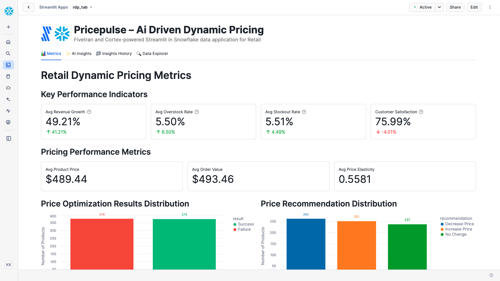

# PricePulse – AI-driven Dynamic Pricing

A Fivetran and Cortex-powered Streamlit in Snowflake data application for Retail.

## Overview

PricePulse is an AI-driven dynamic pricing system that helps retailers maximize profits through real-time price optimization. This Streamlit in Snowflake data application helps pricing managers, inventory managers, and marketing teams respond quickly to market fluctuations, reducing overstocking and stockouts while increasing revenue and customer satisfaction.

The application utilizes a synthetic retail dataset that simulates data from point of sale systems, customer relationship management platforms, and inventory management systems. This synthetic data is moved into Snowflake using a custom connector built with the Fivetran Connector SDK, enabling reliable and efficient data pipelines for retail analytics.

## Data Sources

The application is designed to work with data from major retail systems and platforms:

### Retail Data Sources (Simulated)
- **Point of Sale (POS)**: 
  - Shopify
  - Square
  - Lightspeed
- **Customer Relationship Management (CRM)**: 
  - Salesforce
  - HubSpot
  - Zoho
- **Inventory Management**: 
  - Manhattan Associates
  - Oracle Retail
  - JDA Software

For demonstration and development purposes, we've created a synthetic dataset that approximates these data sources and combined them into a single table exposed through an API server. This approach allows for realistic retail analytics without using protected customer information.

## Key Features

- **Real-time market data analysis**: Analyzes sales data, market trends, and competitive information to inform pricing decisions
- **Predictive demand forecasting**: Predicts future demand based on historical data and market factors
- **Automated price optimization**: Automatically recommends optimal pricing for products based on multiple factors
- **Integration with synthetic retail data**: Simulates data from major POS, CRM, and inventory management systems
- **Comprehensive data application**: Visual representation of key metrics including revenue growth, stockout rates, overstock rates, and customer satisfaction
- **AI-powered insights**: Generate in-depth analysis of overall performance, optimization opportunities, financial impact, and strategic recommendations
- **Custom Fivetran connector**: Utilizes a custom connector built with the Fivetran Connector SDK to reliably move data from the API server to Snowflake

## Streamlit Data App Sections

### 📊 Metrics
- **Key Performance Indicators**: Track revenue growth, overstock rates, stockout rates, and customer satisfaction
- **Pricing Performance Metrics**: Monitor product prices, order values, and price elasticity
- **Price Optimization Results Distribution**: Visualize the success rate of price optimization recommendations
- **Customer Segment Distribution**: Analyze customer distribution across segments
- **Product Category Analysis**: Explore product categories and subcategories
- **Revenue Growth vs Customer Satisfaction Quadrant Analysis**: Map products by revenue growth and satisfaction performance
- **Price Elasticity vs Inventory Turnover Analysis**: Understand the relationship between price sensitivity and inventory efficiency
- **Order Status Distribution**: Monitor order fulfillment and cancellation rates
- **Inventory Management Summary**: Track stockout rates, overstock rates, and inventory turnover

### ✨ AI Insights
Generate AI-powered insights with different focus areas:
- **Overall Performance**: Comprehensive analysis of the dynamic pricing system
- **Optimization Opportunities**: Areas where pricing optimization can be improved
- **Financial Impact**: Cost-benefit analysis and ROI in retail terms
- **Strategic Recommendations**: Long-term strategic implications for improvement

### 📁 Insights History
Access previously generated insights for reference and comparison.

### 🔍 Data Explorer
Explore the underlying data with pagination controls.

## Setup Instructions

1. Within Snowflake, click on **Projects**
2. Click on **Streamlit**
3. Click the blue box in the upper right to create a new Streamlit application
4. On the next page:
   - Name your application
   - **IMPORTANT:** Set the database context
   - **IMPORTANT:** Set the schema context

### Fivetran Data Movement Setup

1. Ensure the API server hosting the synthetic retail data is operational
2. Configure the custom Fivetran connector (built with Fivetran Connector SDK) to connect to the API server - debug and deploy
3. Start the Fivetran sync in the Fivetran UI to move data into an `RDP_RECORDS` table in your Snowflake instance
4. Verify data is being loaded correctly by checking the table in Snowflake

## Data Flow

1. **Synthetic Data Creation**: A synthetic dataset approximating real retail data sources has been created and exposed via an API server:
   - Point of Sale: Shopify, Square, Lightspeed
   - Customer Relationship Management: Salesforce, HubSpot, Zoho
   - Inventory Management: Manhattan Associates, Oracle Retail, JDA Software

2. **Custom Data Integration**: A custom connector built with the Fivetran Connector SDK communicates with the API server to extract the synthetic retail data

3. **Automated Data Movement**: Fivetran manages the orchestration and scheduling of data movement from the API server into Snowflake

4. **Data Loading**: The synthetic retail data is loaded into Snowflake as an `RDP_RECORDS` table in a structured format ready for analysis

5. **Data Analysis**: Snowpark for Python and Snowflake Cortex analyze the data to generate insights

6. **Data Visualization**: Streamlit in Snowflake presents the analyzed data in an interactive data application

## Data Requirements

The application expects a table named `RDP_RECORDS` which contains synthetic data simulating various retail systems. This data is retrieved from an API server using a custom Fivetran connector built with the Fivetran Connector SDK:

### Order and Customer Data
- `order_id`
- `order_date`
- `order_total`
- `order_status`
- `customer_id`
- `customer_segment`
- `customer_ltv`
- `order_frequency`
- `average_order_value`

### Product Data
- `product_id`
- `product_category`
- `product_subcategory`
- `product_price`
- `product_rating`
- `product_review_count`

### Pricing Metrics
- `price_elasticity`
- `price_optimization_date`
- `price_optimization_result`
- `price_optimization_recommendation`

### Inventory Data
- `inventory_level`
- `inventory_turnover`
- `stockout_rate`
- `overstock_rate`
- `demand_forecast`

### Performance Metrics
- `revenue_growth_rate`
- `customer_satisfaction_rate`

## Benefits

- 8% increase in revenue: $800,000 additional revenue/year
- 12% reduction in overstocking: $60,000 savings/year
- 10% decrease in stockouts: $20,000 savings/year
- 5% improvement in customer satisfaction: 4% increase in customer satisfaction

## Technical Details

This application uses:
- Streamlit in Snowflake for the user interface
- Snowflake Cortex for AI-powered insights generation
- Multiple AI models including Llama 3.1/3.3, Mistral, Claude, and more
- Snowpark for Python for data processing
- **Fivetran Connector SDK** for building a custom connector to retrieve synthetic retail data from an API server
- **Custom Fivetran connector** for automated, reliable data movement into Snowflake