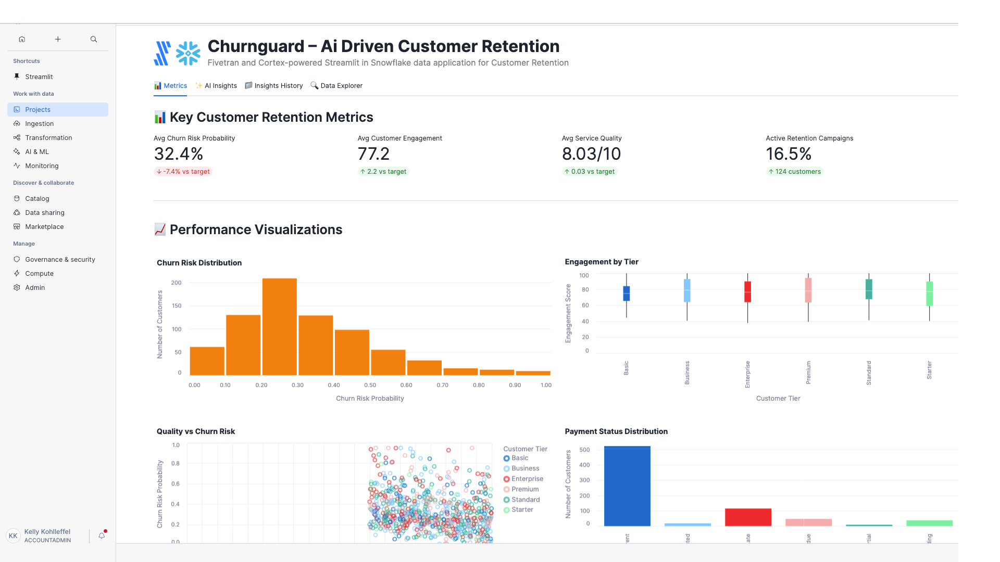

# ChurnGuard – AI-driven Customer Retention

A Fivetran and Cortex-powered Streamlit in Snowflake data application for Customer Retention Optimization with advanced AI Agent Workflows.

## Overview

ChurnGuard is an intelligent customer retention system that helps companies automate the manual and time-consuming process of analyzing customer behavior, engagement patterns, and churn risk indicators. This Streamlit in Snowflake data application helps Marketing Managers, Chief Marketing Officers, and Customer Service Representatives reduce customer churn rates, improve customer engagement, and optimize retention strategies through real-time analysis of customer relationship data.

The application features sophisticated AI Agent Workflows that provide transparent, step-by-step analysis of customer retention data, transforming complex churn prediction models and engagement optimization strategies into actionable customer insights and personalized retention recommendations. Each analysis focus area operates through specialized mini-agents that simulate the decision-making process of experienced marketing managers and customer retention experts.

The application utilizes a synthetic customer dataset that simulates data from CRM platforms, usage analytics systems, and social media monitoring services. This synthetic data is moved into Snowflake using a custom connector built with the Fivetran Connector SDK, enabling reliable and efficient data pipelines for customer retention analytics.

## AI Agent Workflows

### Agent Architecture Overview

ChurnGuard employs a sophisticated multi-agent architecture designed specifically for customer retention optimization analysis. Each focus area operates through specialized AI agents that break down complex customer behavior analysis and retention strategy tasks into transparent, sequential steps that mirror the thought processes of experienced marketing managers and customer retention professionals.

### Focus Area Agents

#### Overall Performance Agent
**Business Challenge**: Marketing Managers and Chief Marketing Officers manually review hundreds of customer accounts, engagement metrics, and churn indicators daily, spending 4+ hours analyzing customer behavior patterns, social sentiment, and usage trends to identify high-risk customers and retention opportunities.

**Agent Solution**: Autonomous customer retention workflow that analyzes customer data, engagement metrics, churn probabilities, and social sentiment to generate automated customer summaries, identify at-risk customers, and produce prioritized retention insights with personalized engagement recommendations.

**Agent Workflow Steps**:
1. **Customer Retention Data Initialization** - Loading comprehensive customer retention dataset with enhanced validation across customer records and engagement metrics
2. **Churn Risk Assessment** - Advanced calculation of customer retention indicators with churn analysis
3. **Customer Behavior Pattern Recognition** - Sophisticated identification of retention patterns with engagement correlation analysis
4. **AI Customer Intelligence Processing** - Processing comprehensive customer data through selected AI model with advanced reasoning
5. **Customer Retention Report Compilation** - Professional customer retention analysis with evidence-based recommendations and actionable engagement insights

#### Optimization Opportunities Agent
**Business Challenge**: Customer Service Representatives and Marketing Managers spend 5+ hours daily manually identifying inefficiencies in customer retention strategies, engagement campaign criteria, and support ticket resolution across multiple customer segments and communication channels.

**Agent Solution**: AI-powered customer retention optimization analysis that automatically detects engagement performance gaps, support efficiency opportunities, and customer satisfaction improvements with specific implementation recommendations for Salesforce, Zoho CRM, and social media platform integration.

**Agent Workflow Steps**:
1. **Customer Retention Optimization Data Preparation** - Advanced loading of customer retention data with enhanced validation for engagement improvement identification
2. **Engagement Performance Inefficiency Detection** - Sophisticated analysis of customer retention strategies and engagement performance with evidence-based inefficiency identification
3. **Customer Behavior Correlation Analysis** - Enhanced examination of relationships between customer tiers, social sentiment, and engagement performance rates
4. **CRM Integration Optimization** - Comprehensive evaluation of customer retention integration with existing Salesforce, Zoho CRM, and social media systems
5. **AI Customer Intelligence** - Generating advanced customer optimization recommendations using selected AI model with retention reasoning
6. **Customer Strategy Finalization** - Professional customer optimization report with prioritized implementation roadmap and engagement impact analysis

#### Financial Impact Agent
**Business Challenge**: Chief Marketing Officers manually calculate complex ROI metrics across customer retention activities and acquisition cost performance, requiring 4+ hours of financial modeling to assess customer lifetime value and retention campaign effectiveness across the customer portfolio.

**Agent Solution**: Automated customer retention financial analysis that calculates comprehensive customer lifetime value ROI, identifies cost reduction opportunities across customer segments, and projects retention performance benefits with detailed revenue forecasting.

**Agent Workflow Steps**:
1. **Customer Financial Data Integration** - Advanced loading of customer financial data and retention cost metrics with enhanced validation across customer records
2. **Customer Retention Cost-Benefit Calculation** - Sophisticated ROI metrics calculation with customer analysis and retention campaign efficiency cost savings
3. **Customer Lifetime Value Impact Assessment** - Enhanced analysis of customer revenue impact with engagement metrics and retention correlation analysis
4. **Customer Acquisition Efficiency Analysis** - Comprehensive evaluation of acquisition cost efficiency across customer activities with customer lifecycle cost optimization
5. **AI Customer Financial Modeling** - Advanced customer retention financial projections and ROI calculations using selected AI model
6. **Customer Economics Report Generation** - Professional customer financial impact analysis with detailed retention ROI calculations and customer cost forecasting

#### Strategic Recommendations Agent
**Business Challenge**: Chief Marketing Officers spend hours manually analyzing digital transformation opportunities and developing strategic customer retention roadmaps for engagement advancement and personalized marketing implementation across customer portfolios.

**Agent Solution**: Strategic customer retention intelligence workflow that analyzes competitive advantages against traditional retention processes, identifies AI and personalization integration opportunities, and creates prioritized digital customer experience transformation roadmaps.

**Agent Workflow Steps**:
1. **Customer Technology Assessment** - Advanced loading of customer retention digital context with competitive positioning analysis across customer records and active customers
2. **Customer Competitive Advantage Analysis** - Sophisticated evaluation of competitive positioning against traditional customer retention with AI-powered customer optimization effectiveness
3. **Advanced Customer Technology Integration** - Enhanced analysis of integration opportunities with social media analytics, real-time sentiment monitoring, and AI-powered customer sensing across customer data dimensions
4. **Digital Customer Strategy Development** - Comprehensive development of prioritized digital transformation roadmap with evidence-based customer technology adoption strategies
5. **AI Customer Strategic Processing** - Advanced customer retention strategic recommendations using selected AI model with long-term competitive positioning
6. **Digital Customer Report Generation** - Professional digital customer transformation roadmap with competitive analysis and retention technology implementation plan ready for CMO executive review

### Agent Execution Flow

1. **Agent Initialization** - User selects focus area and AI model, triggering specialized agent activation
2. **Data Context Loading** - Agent accesses customer data, engagement metrics, and churn indicators
3. **Step-by-Step Processing** - Agent executes sequential workflow steps with real-time progress visualization
4. **Customer Intelligence Integration** - Selected Snowflake Cortex model processes customer context with specialized prompting
5. **Results Compilation** - Agent generates comprehensive customer retention analysis with actionable retention recommendations
6. **Report Delivery** - Professional customer retention report delivered with implementation roadmap and success metrics

## Data Sources

The application is designed to work with data from major customer relationship management and analytics systems:

### Customer Data Sources (Simulated)
- **Customer Relationship Management (CRM)**: 
  - Salesforce
  - Zoho CRM
  - HubSpot
- **Customer Usage Data**: 
  - Ericsson Expert Analytics
  - Nokia Customer Experience Management
  - Adobe Analytics
- **Social Media Data**: 
  - Twitter API
  - Facebook Graph API
  - Instagram Business API
- **Customer Support Systems**:
  - Zendesk
  - ServiceNow
  - Freshdesk
- **Email Marketing Platforms**:
  - Mailchimp
  - SendGrid
  - Constant Contact
- **Customer Engagement Platforms**:
  - Mixpanel
  - Amplitude
  - Intercom

For demonstration and development purposes, we've created a synthetic dataset that approximates these data sources and combined them into a single table exposed through an API server. This approach allows for realistic customer retention analytics without using proprietary customer data.

## Key Features

- **AI Agent Workflows**: Transparent, step-by-step customer retention analysis through specialized mini-agents for each focus area
- **Agent Progress Visualization**: Real-time display of agent processing steps with customer context and completion tracking
- **Focus Area Specialization**: Dedicated agents for Overall Performance, Optimization Opportunities, Financial Impact, and Strategic Recommendations
- **Customer Intelligence Integration**: Seamless integration with multiple Snowflake Cortex models for specialized customer analysis
- **AI-powered customer churn prediction**: Leverages generative AI to analyze customer patterns and automatically generate optimized retention models with key insights
- **Integration with synthetic customer data**: Simulates data from major CRM platforms, usage analytics systems, and social media monitoring providers
- **Comprehensive data application**: Visual representation of key metrics including churn risk probability, customer engagement scores, service quality ratings, and social sentiment analysis
- **Custom Fivetran connector**: Utilizes a custom connector built with the Fivetran Connector SDK to reliably move data from the API server to Snowflake

## Streamlit Data App Sections

### Metrics
- **Key Performance Indicators**: Track Average Churn Risk Probability, Customer Engagement Score, Service Quality Rating, and Active Retention Campaigns
- **Customer Analytics**: Monitor customer tiers, usage trends, and customer retention efficiency
- **Churn Risk Distribution**: Visualize churn probability patterns across customer segments
- **Engagement Analysis**: Analyze customer engagement by tier with comprehensive visualizations
- **Social Sentiment**: Track social sentiment scores and mention counts across customers
- **Contract Value Trends**: Review contract value distribution across usage patterns
- **Support Impact Analysis**: Monitor support ticket correlation with churn risk
- **Usage Pattern Insights**: Assess data consumption vs usage minutes relationships

### AI Insights with Agent Workflows
Generate AI-powered insights through transparent agent workflows with different focus areas:
- **Overall Performance**: Comprehensive analysis of the customer retention and churn prevention system through autonomous customer workflow
- **Optimization Opportunities**: Areas where customer engagement and retention rates can be improved via AI-powered customer optimization analysis
- **Financial Impact**: Cost-benefit analysis and ROI in customer retention terms through automated customer financial analysis
- **Strategic Recommendations**: Long-term strategic implications for digital transformation via strategic customer intelligence workflow

Each focus area includes:
- **Business Challenge Description**: Detailed explanation of the specific customer retention problem being addressed
- **Agent Solution Overview**: Description of how the AI agent workflow solves the customer challenge
- **Real-time Progress Tracking**: Step-by-step visualization of agent processing with customer context
- **Agent Execution Controls**: Start/stop controls for managing agent workflow execution
- **Professional Customer Reports**: Comprehensive analysis reports with implementation roadmaps

### Insights History
Access previously generated agent-driven insights for reference and comparison, including agent execution details and model selection.

### Data Explorer
Explore the underlying customer retention data with pagination controls.

## Setup Instructions

1. Within Snowflake, click on **Projects**
2. Click on **Streamlit**
3. Click the blue box in the upper right to create a new Streamlit application
4. On the next page:
   - Name your application
   - **IMPORTANT:** Set the database context
   - **IMPORTANT:** Set the schema context

### Fivetran Data Movement Setup

1. Ensure the API server hosting the synthetic customer data is operational
2. Configure the custom Fivetran connector (built with Fivetran Connector SDK) to connect to the API server - debug and deploy
3. Start the Fivetran sync in the Fivetran UI to move data into a `TLC_RECORDS` table in your Snowflake instance
4. Verify data is being loaded correctly by checking the table in Snowflake

## Data Flow

1. **Synthetic Data Creation**: A synthetic dataset approximating real customer retention data sources has been created and exposed via an API server:
   - Customer Relationship Management: Salesforce, Zoho CRM, HubSpot
   - Usage Analytics: Ericsson Expert Analytics, Nokia Customer Experience Management, Adobe Analytics
   - Social Media: Twitter API, Facebook Graph API, Instagram Business API

2. **Custom Data Integration**: A custom connector built with the Fivetran Connector SDK communicates with the API server to extract the synthetic customer data

3. **Automated Data Movement**: Fivetran manages the orchestration and scheduling of data movement from the API server into Snowflake

4. **Data Loading**: The synthetic customer data is loaded into Snowflake as a `TLC_RECORDS` table in a structured format ready for analysis

5. **Agent Workflow Execution**: AI agents process the customer retention data through specialized workflows, providing transparent step-by-step analysis

6. **Data Analysis**: Snowpark for Python and Snowflake Cortex analyze the data to generate insights through agent-driven processes

7. **Data Visualization**: Streamlit in Snowflake presents the analyzed data in an interactive data application with agent workflow visualization

## Data Requirements

The application expects a table named `TLC_RECORDS` which contains synthetic data simulating various customer relationship management systems. This data is retrieved from an API server using a custom Fivetran connector built with the Fivetran Connector SDK:

### Customer Profile Data
- `record_id`
- `customer_id`
- `account_name`
- `customer_tier`
- `account_created_date`
- `last_interaction_date`
- `total_contract_value`
- `payment_status`

### Customer Engagement Metrics
- `support_tickets_count`
- `monthly_usage_minutes`
- `data_consumption_gb`
- `service_quality_score`
- `network_performance_rating`
- `usage_trend_30d`
- `engagement_score`
- `churn_risk_probability`
- `retention_campaign_active`

### Social Media & Sentiment
- `social_sentiment_score`
- `social_mentions_count`
- `last_updated_timestamp`

## Benefits

- **100 fewer churned customers per year**: 10,000 customers/year × 10% churn rate × 10% reduction = 100 fewer churned customers/year
- **$1,000,000 in revenue retention annually**: $10,000,000 annual revenue × 10% churn rate × 10% reduction = $1,000,000 retained revenue/year
- **15% increase in customer engagement**: 60% baseline engagement rate × 15% improvement = 69% engagement rate
- **$1,000,000 savings in customer acquisition costs**: $5,000,000 annual acquisition costs × 20% reduction = $1,000,000 savings/year
- **Enhanced Customer Transparency**: Agent workflows provide clear visibility into customer retention analysis reasoning and decision-making processes
- **Accelerated Customer Insights**: Automated agent processing reduces manual analysis time from hours to minutes for complex customer assessments

## Technical Details

This application uses:
- **AI Agent Workflow Engine**: Custom agent orchestration system for transparent, step-by-step customer retention analysis
- **Multi-Agent Architecture**: Specialized agents for different customer focus areas with domain-specific processing
- **Agent Progress Visualization**: Real-time display of agent execution steps with customer context and completion tracking
- **Streamlit in Snowflake** for the user interface with enhanced agent workflow displays
- **Snowflake Cortex** for AI-powered insights generation through agent-managed prompting
- **Multiple AI models** including OpenAI GPT, Claude 4 Sonnet, Claude 3.5 Sonnet, Llama 3.1/3.3, Mistral, DeepSeek, and more for agent intelligence
- **Snowpark for Python** for data processing within agent workflows
- **Fivetran Connector SDK** for building a custom connector to retrieve synthetic customer data from an API server
- **Custom Fivetran connector** for automated, reliable data movement into Snowflake

## Success Metrics

- Customer churn rate reduction
- Customer lifetime value optimization
- Customer engagement improvement
- Customer acquisition cost reduction
- Customer satisfaction scores
- **Agent Workflow Efficiency**: Time reduction from manual customer analysis to automated agent-driven insights
- **Customer Transparency Score**: User confidence in retention recommendations through visible agent reasoning
- **Retention Optimization Accuracy**: Improvement in customer retention success rates through systematic agent processing

## Key Stakeholders

- Marketing Managers
- Customer Service Representatives
- Sales Teams
- Customer Success Managers
- Data Analysts
- Chief Marketing Officer (CMO)
- Customer Experience Managers
- Retention Specialists
- Campaign Managers
- **Customer Operations Analysts**: Professionals who benefit from transparent agent workflow visibility
- **Customer Retention Teams**: Staff who implement agent-recommended customer engagement strategies

## Competitive Advantage

ChurnGuard differentiates itself by leveraging generative AI with transparent agent workflows to automate the customer retention process, reducing manual labor and increasing the speed of insights. The agent-based architecture provides unprecedented visibility into customer analysis reasoning, building trust and confidence in AI-driven retention decisions. This creates a competitive advantage by enabling faster decision-making and improved customer retention in marketing operations while maintaining complete transparency in the analysis process.

Proactive customer retention strategies reduce churn and improve customer loyalty through personalized marketing campaigns that increase customer engagement and satisfaction.

## Long-term Evolution

In the next 3-5 years, ChurnGuard will evolve to incorporate more advanced generative AI techniques and sophisticated agent architectures, including:

- **Multi-modal Agent Learning**: Agents that can process social media sentiment, usage analytics, and customer communications from diverse customer systems
- **Collaborative Agent Networks**: Multiple agents working together to solve complex customer retention challenges across different customer segments
- **Adaptive Agent Intelligence**: Self-improving agents that learn from customer outcomes and refine their analytical approaches
- **Advanced Agent Orchestration**: Sophisticated workflow management for complex, multi-step customer analysis processes
- **Integration with Emerging Customer Technologies**: Agent connectivity with IoT devices, real-time customer behavior analysis, and automated retention campaigns for comprehensive customer intelligence

The system will expand to include integration with emerging technologies like IoT devices for real-time customer behavior analysis and predictive analytics for new customer acquisition, all orchestrated through advanced agent workflows that provide complete transparency and control over the customer retention analysis process.